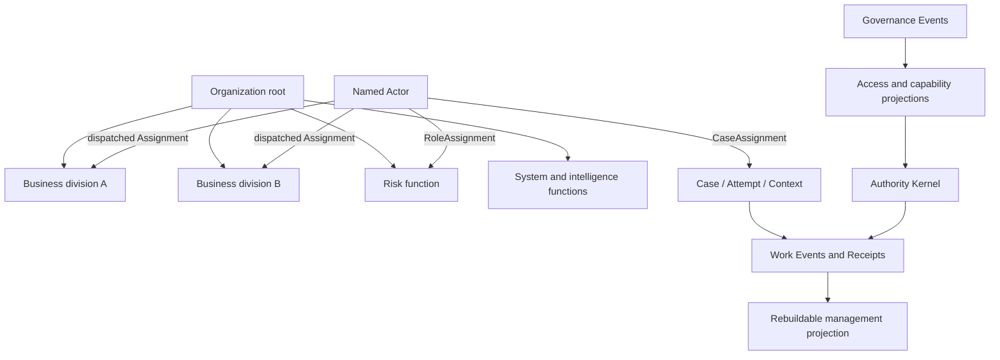

# 见微 V4 Backend Refactor Control Contract

状态：`CONTROL DRAFT / IMPLEMENTATION GATED`

本文件由 V4-CTRL 维护，用于指挥 V4-BACK 与受控智谱 checkpoint。它描述后端系统边界、执行顺序和验收 Gate，不以当前前端页面数量作为架构边界。

## 1. North Star

V4 后端只分为两个业务系统和一个共享内核：

1. **作业流程系统（Work Execution System）**：围绕单个融资租赁事项，处理事实、证据、建议、人工确认、正式决定、结果凭证和后续承接。
2. **管理与治理系统（Management & Governance System）**：跨事项管理组织范围、访问权限、能力注册、路由策略、版本发布、暂停、回退、运行质量和审计。
3. **共享权威内核（Shared Authority Kernel）**：统一 Identity、Scope、Context Version、Policy、Event、Receipt、idempotency 和 fail-closed 规则。

前端的管理总览、事项作业、体系改进可以合并或拆分，但只能消费后端 Projection，不能成为事实源、权威源或 Receipt 生成者。

后端同时受 `Compute Scarcity Contract` 约束：租赁侧本地 GPU 算力稀缺，系统必须采用 `compute-by-exception`、event-driven admission、exact Context/Evidence hash replay、deterministic rule/retrieval/cache first、incremental invalidation、smallest eligible capability first 和 budget fail-closed。禁止常驻重推理、空转 heartbeat、无边界 Agent loop、静默 retry 和默认并发推理。每次真实模型执行必须产生独立、可审计的 `ComputeReceipt`；业务 Receipt 与 Compute Receipt 不得混为同一对象。

**Current checkpoint (2026-09-02):** `CP1A-AUTH-00`、完整 CP1B pure domain slice、CP1C read spine、`CP2-AGG-01/R1`、`CP2-HANDLER-02A/R1`、`CP2-HANDLER-02B/R1` 与 `CP2-HANDLER-03A` 已获 CTRL 本地接受。CP2 aggregate 对 11 类 WorkEvent 进行 pure append-only replay；`accept_evidence` 已证明 server-derived Actor/Authority、fresh Context、scoped idempotency、atomic Event + Evidence Receipt + Projection + response commit；`record_candidate` 已证明 server-owned Candidate/Governance/Admission provenance、`authority=none`、具名 Human identity 解析、atomic Candidate Event + pending Human Gate + Candidate Receipt；`submit_credit_decision` 已证明真实 `Evidence → Candidate → named Human Decision` 链、canonical Evidence/Candidate/Decision Receipt lineage、active credit assignment 复验、exact idempotent replay，以及 failure zero-write。最新 focused handler/aggregate 51/51、03A controller 6/6、canonical full suite 391/391，full typecheck、lint、build 全绿。当前仍只有 synchronous in-memory 三命令闭环；无 Handoff command、durable persistence、V4 write POST、Routing/Adapter execution 或真实 identity provider。

**Control update (2026-09-02):** `CP2-HANDLER-03A/R0` 的单一智谱 lane 已 `turn.completed`，但因 command count `24 > 12`、重复 allowed reads 与一个 nonzero command 被 Route v2 判为 `scope_rejected`；本次使用 input `1,558,360`（cached `1,418,240`、fresh `140,120`）与 output `19,219`，也不满足新冻结的低算力执行方向。候选代码不得追溯接受，Controller Gate 未运行。LAND 静态审查进一步确认：handler 存在重复残片导致 syntax failure；Decision 只检查 Projection lineage，未核对 canonical Evidence/Candidate Receipts；未在 Decision 时重新验证 active credit assignment；focused test 直接 seed Events，未证明真实 `accept_evidence → record_candidate → submit_credit_decision` 链；aggregate contract tests 未随 exact Event shape 更新。Disposition 固定为 `REJECTED CANDIDATE / REPAIRABLE`。下一唯一候选为一次 fresh、单 lane、严格 bounded 的 `CP2-HANDLER-03A/R1` repair；在 LAND 重新交棒前 `V4-BACK` idle。Frontend 暂停，不进入当前执行主线。

**Repair update (2026-09-02):** `CP2-HANDLER-03A/R1` transport clean、scope valid，使用 fresh input `15,889`、cached `7,296`、output `6,505`；但 worker 把七个 allowed files 合并到一次读取，tool output 被截断，随后 consolidated patch validation 失败。它按约束停止，`changedFiles=[]`、`acceptanceRuns=0`、Controller Gate 未运行，Disposition 为 `worker_acceptance_rejected`。同一目标的原 invocation 与唯一 repair 均未成功，依照 GLM route hard stop 禁止第三次静默重试；当前 baton 在 LAND，`V4-BACK` idle。下一步只能由用户明确授权 `V4-BACK` 使用 Terra 完成 bounded direct repair，或暂停 03A 重新设计新的独立 checkpoint；不得 silent fallback。

**Acceptance update (2026-09-02):** 用户明确授权后，`V4-BACK` 以 Terra 完成 bounded direct repair，并将候选交回 LAND。LAND 独立修正 controller fixture、复核 canonical Receipt lineage 与 active assignment fail-closed 行为，并完成 focused 51/51、03A controller 6/6、canonical full suite 391/391、typecheck、lint、build。`CP2-HANDLER-03A` disposition 固定为 `LOCALLY ACCEPTED / SYNCHRONOUS IN-MEMORY ONLY`。此前两次智谱失败仍保留为算力与 scope 证据，不追溯改写为成功。当前 baton 在 LAND，`V4-BACK` idle；Frontend 仍暂停。

## 2. 不可突破的权威边界

- Model、Agent 和 capability output 永远 `authority=none`；它们只能形成 Evidence 或 Candidate。
- 专业决定只能来自具名 Human Gate，或组织明确批准、具有版本/范围/回退信息的 deterministic authorized rule。
- 管理者可以管理组织范围、访问权限和能力生命周期，但不会因此自动获得信审、商务或资产的专业决定权。
- 技术管理员可以发布、暂停、回退 capability version；不能直接修改 Case 的正式专业结论。
- UI click、worker completion、HTTP 2xx 和 optimistic state 都不是正式成功；正式动作必须产生 canonical Receipt。
- unknown、timeout、stale Context、权限不明和 provider failure 一律 fail closed。

### 2.1 三条正交权力线

V4 不使用一个全局 `roleLevel` 或简单金字塔决定所有权限。后端必须同时表达三条互不替代的权力线：

1. **组织管理线**：集团 → 事业部 → 部门 → 团队。用于观察范围、人员与事项分配、升级、优先级和质量管理。
2. **专业决定线**：业务推进 → 政策/规则支持 → 信审 → 商务 → 资产 → 起租。业务推进属于 `manage_work`，政策/规则支持属于受版本治理的输入；第一批正式 per-case Gate 仅为信审、商务、资产、起租。每个专业只决定自己被授权的 Gate；前一阶段通过不代表后一阶段通过。
3. **技术治理线**：提议 → 验证 → 批准 → 发布 → 观察 → 暂停/回退/退役。用于系统、规则、Capability、Adapter 和版本治理，不直接替代 Case 专业决定。

一个人可以同时拥有多条线上的多个 Assignment，但每次动作仍必须由 `actorId + action + resourceScope + policyVersion + contextVersion` 单独判权。职位高低本身不是正式 Decision 的充分条件。

#### Formal tree and matrix overlays

后端不把全部现实关系压成一棵“万能金字塔”：

- `OrganizationUnit` 形成唯一 formal containment tree；root/事业部/部门/团队用于 scope inheritance；
- 集团最高负责人只是 root scope 上的一个具名 management Assignment，不是代码内硬编码的 superuser；
- 风控派驻、跨事业部支持、系统/智能协作通过多个 `RoleAssignment` / `ResponsibilityLink` 表达，不复制 Actor，也不改变 formal parent；
- 项目和具体事项团队通过 `CaseAssignment` 叠加在组织树上，Case 不成为 OrganizationUnit；
- 左右连接、协作线和视觉分区都是这些 edge 的 Projection，不能产生隐式权限；
- formal tree 负责“包含关系”，Assignment graph 负责“谁在何处承担什么职责”，Case graph 负责“当前事项由谁承接”。

因此视觉上可以表现为可无限延展的“大厦/世界树/根系网络”，但 Authority Kernel 只接受明确、版本化的 node/edge/scope，不接受屏幕位置、上下层或连线作为授权依据。



### 2.2 Actor 与角色族

`ActorIdentity` 与 `RoleAssignment` 必须分开：Actor 是“谁”，Assignment 是“在什么范围内承担什么职责”。Role 只用于 policy 输入，不自动产生权限。

#### 人类 Actor

- `internal_human`：集团内部具名人员；
- `external_human`：客户、供应商或其他被邀请参与者，只能访问 invitation scope；
- 人类 Actor 可拥有以下角色族，但具体 action grant 必须由组织 policy 注入：
  - 作业角色：`business_worker`、`policy_professional`、`credit_professional`、`commercial_professional`、`asset_professional`；
  - 管理角色：`team_manager`、`organization_director`；
  - 技术治理角色：`access_administrator`、`system_owner`、`capability_owner`、`intelligence_operator`、`release_approver`、`audit_observer`。

#### 非人主体

- `authorized_rule`：组织批准的确定性规则，只能在 version/scope/approval/rollback 全部有效时形成指定正式结果；
- `system_service`：执行校验、持久化、投影和 Receipt 生成，不拥有自由裁量权；
- `capability`：模型、Agent、Skill 或算法能力，只能输出 EvidenceDraft/CandidateDraft，永远 `authority=none`；
- `execution_adapter`：调用底层 Harness/模型/既有系统的技术端口，不是 Actor，不参与专业判权。

Capability、Registry、Policy、Event、Receipt 和 Projection 都是对象或服务，不得伪装成人员角色。

### 2.3 动作等级与决定边界

动作不是按一个数字从低到高授权，而按 action family 隔离：

| Action family | 可以做什么 | 不能自动做什么 |
|---|---|---|
| `observe` | 查看授权范围内的 Case、运行状态和治理记录 | 修改任何正式状态 |
| `prepare` | 在指定 Case 和 fresh Context 下补充事实、提交 EvidenceDraft、形成 CandidateDraft | 形成正式 Decision/Receipt |
| `manage_work` | 分配、催办、升级、请求补充、调整管理优先级 | 代签信审/商务/资产 Gate |
| `professional_decide` | 在明确专业 action + scope 下作出正式决定 | 决定其他专业阶段或技术发布 |
| `govern_access` | 提议/批准/撤销 AccessGrant | 取得未单独授予的专业决定权 |
| `govern_capability` | 提议、验证、批准、发布、暂停、回退、退役 CapabilityVersion | 改写已有 Case Decision |
| `execute_authorized_action` | Authority Kernel 校验后执行并产生 canonical Receipt | 自行选择业务结论 |

权限冲突时固定优先级：invalid identity → invalid role assignment → resource/scope mismatch → explicit deny → missing grant → stale context → stale policy → authority-source restriction → allowed。`RoleAssignment` 只作为 policy 输入；actor 或 scope 不一致时 fail closed，完全一致时也不能单独授权。任何 unknown 都返回拒绝且零写入。

CP1A 的 action-resource matrix 固定为：organization/case/capability/access 的 observe 各自只读取同类资源；`prepare`、`manage_work`、`professional_decide` 和 `execute_authorized_action` 只作用于 Case；`govern_access` 只作用于 AccessGrant；`govern_capability` 只作用于 CapabilityVersion。跨对象组合即使存在 grant 也在 scope Gate fail closed。

### 2.4 两个系统之间的流转

```text
作业输入
  → server resolves Actor / OrganizationScope
  → Evidence accepted and Context versioned
  → eligible Capability parallel preparation
  → EvidenceDraft / CandidateDraft (authority none)
  → Authority Kernel evaluates named Human or authorized rule
  → Decision + canonical Receipt
  → Handoff to next professional stage

append-only Events / Receipts
  → rebuildable Management Projection
  → manager observes / assigns / escalates
  → repeated problem becomes GovernanceProposal
  → system + intelligence evaluation
  → governance approval + ReleaseReceipt
  → Capability/Policy version activated, observed, suspended or rolled back
```

管理系统通过 Projection 观察作业系统；治理动作通过版本化 Policy/Capability 影响未来 admission/routing。它不得反向覆盖已经发生的 Evidence、Decision 或 Receipt。

## 3. 共享内核的 canonical objects

### 3.1 Identity and scope

- `ActorIdentity`：具名人员、组织服务主体或确定性规则主体；Agent 不进入正式 Actor 集合。
- `OrganizationScope`：集团、事业部、部门、团队或被授权事项范围。
- `AccessGrant`：谁在什么范围内可以读取、建议、发起 Gate 或执行治理动作；权限来源必须可追溯。
- `PolicyVersion`：权限与正式规则的版本、批准者、生效范围、有效期和回退目标。

### 3.2 Work objects

- `Case` / `Attempt`：长期事项身份与一次处理尝试分离。
- `ContextVersion`：正式事实视图版本；stale command 必须拒绝。
- `EvidenceReceipt`：被系统接受的证据引用，不等于结论。
- `Candidate`：能力基于 Evidence 形成的建议，`authority=none`。
- `HumanGate` / `Decision`：具名专业人员基于指定 Context 和 Evidence 作出的正式决定。
- `ActionReceipt`：动作执行结果的唯一正式凭证。
- `Handoff`：从当前专业阶段交给下一责任域；信审通过不等于商务、资产或起租完成。

### 3.3 Governance objects

- `CapabilityDefinition`：能力身份、purpose、owner、输入/输出种类与禁止项。
- `CapabilityVersion`：不可变版本、runtime adapter、schema、evaluation evidence 与 provenance。
- `CapabilityManifest`：entry conditions、allowed reads、allowed outputs、authority、exit conditions、timeout、fallback 和 handoff。
- `AdmissionDecision`：当前 capability version 是否可进入候选集合及原因。
- `RoutingDecision`：在 eligible versions 中选择执行目标；必须可解释、可重放。
- `GovernanceProposal` / `Evaluation` / `Approval`：能力或策略变化的提议、验证和批准链。
- `ReleaseReceipt` / `RollbackReceipt`：发布或回退的正式结果凭证。
- `RuntimeObservation`：成功率、超时、拒绝、fallback、成本和质量信号；不直接修改正式 Case 状态。

## 4. 两个系统的写入所有权

### 4.1 作业流程系统可以写

- Case/Attempt lifecycle Event；
- Evidence accepted Event；
- Candidate prepared Event；
- named Human Gate Decision；
- Action Receipt；
- Handoff Event。

它不能写 capability 发布状态、全局权限策略或路由配置。

### 4.2 管理与治理系统可以写

- AccessGrant proposal/approval/revocation；
- CapabilityDefinition/Version；
- admission/routing policy version；
- capability activate/suspend/retire/rollback；
- governance Receipt 和 RuntimeObservation。

它不能覆盖 Evidence、删除 Event、伪造 Case Decision，或仅凭管理身份替代专业 Human Gate。

### 4.3 Projection

管理 Projection、事项 Projection、治理 Projection 均为可删除重建的 read model。它们必须引用同一 `caseId`、`attemptId`、`contextVersion`、`actorId`、`capabilityVersion`、`eventId` 和 `receiptId`，不得各自发明身份。

## 5. Logical backend layers

物理目录由 V4-BACK 在当前代码审计后确认，但职责必须保持以下分层：

1. `kernel`：identity、authority、policy、event、receipt、idempotency、error。
2. `work`：Case/Attempt/Context、Evidence、Candidate、Decision、Handoff。
3. `capability`：Definition、Version、Manifest、Admission、Routing、Execution Adapter。
4. `governance`：access、proposal、evaluation、approval、release、suspend、rollback、observation。
5. `persistence`：独立 V4 schema/epoch、append-only ledger、idempotency record、projection checkpoint。
6. `api`：bounded input、server-resolved Actor/Scope、stable error mapping 和 DTO。
7. `projection`：work、management、governance read models。

任何外部 Harness 只通过 `Execution Adapter` 接入；Case、Authority、Event 和 Receipt 不绑定某个 Harness。

### 5.1 Canonical state machines

V4 不使用一个全局状态机。以下状态彼此正交，并通过 Event 关联：

```text
CaseAttempt:
active → waiting_for_evidence → candidate_ready → gate_required
      → returned_for_supplement → resubmitted → gate_required
      → decided → handed_off
      → rejected_current_attempt
      → vetoed_final

CapabilityVersion:
draft → evaluated → approved → shadow → active
                             ↘ suspended → active
                             ↘ rolled_back / retired

AccessGrant:
proposed → approved → active → revoked / expired
```

约束：

- Case、Attempt、Context、专业阶段和能力版本不能压成单个 `status`；
- Case Attempt 状态只由 Work Event 推进；Capability/Access 状态只由 Governance Event 推进；
- capability `active` 不代表对所有 Case eligible；还必须通过 Admission；
- professional Decision 不直接激活 capability，governance release 也不改写既有 Case Decision；
- terminal Event 和 Receipt append-only，Projection 状态可删除重建。

### 5.2 Command transaction pipeline

所有正式写命令固定经过同一条 server-side pipeline：

```text
bounded input
  → resolve authenticated Actor / active Assignments / OrganizationScope
  → validate command + action-resource compatibility
  → idempotency lookup (operation + key + request hash)
  → load Case aggregate + current Context + current Policy/Governance versions
  → evaluate Authority
  → validate state transition and Evidence lineage
  → append Event + canonical Receipt
  → update Projection checkpoint
  → persist idempotency response
  → commit transaction
```

同一个 idempotency key + 相同 request hash 返回原 Receipt；同 key + 不同 hash 返回 conflict。任何 invalid、denied、unknown、stale、timeout、provider failure 或 transaction failure 都零业务写入。Actor、scope、current Context、current policy 和 governance state 必须由 server/store 解析，不能信任 request body。

### 5.3 Current convergence ledger (2026-09-02)

| Surface | Current evidence | Disposition |
|---|---|---|
| P0 Case domain | `lib/v4/types.ts`、`domain.ts` 与 focused tests 已有 pure credit transition、Attempt lineage 和内存 Receipt | 可作为语义参考；尚非 runtime |
| Authority topology | `authority-types.ts` contract 已冻结；用户授权的 OpenAI takeover 修复经 CTRL 静态审查、public 15/15、controller-hidden 4/4、full typecheck 与 lint 通过 | CP1A contract + implementation locally accepted；不代表 CP1B 开放 |
| Authority Event Ledger prototype | unit 12/12、backend integration 5/5；单进程 hook scope root cause 已修复 | provider-free locally verified demo primitive；仍非独立 V4 persistence |
| Capability Registry candidate | compatibility implementation 对既有 exact-shape/authority-none/clone contract 为 8/8；旧 types 仍把 admission 与自报治理字段混在一起 | tests locally verified，但 architecture 仍 rejected，不进入主路径或替代 CP1B |
| Capability Governance reducer | Definition/immutable Version snapshots 与 append-only lifecycle replay；public 11/11 + controller 2/2 | `CP1B-GOV-01/R1` locally accepted；只产生 verified Projection |
| Typed Capability Admission | verified Projection + Case/Context/scope/typed conditions → eligible/ineligible/denied/unknown；public 13/13 + controller 1/1 | `CP1B-ADM-01/R1` locally accepted；无 Routing/Adapter/API/persistence |
| Server-derived read service | server session → Authority → governance replay → Admission → work/management DTO；public 9/9 + controller 1/1 | `CP1C-READ-01/R1` locally accepted；HTTP boundary 见下一行 |
| V4 read HTTP boundary | 两个 GET-only routes，header session、stable error mapping、no-store、unexpected fail-closed；public 7/7 + controller 1/1 | `CP1C-HTTP-02/R1` locally accepted；仅 synthetic unit/build evidence |
| Work Event aggregate | 11-event exact union + append-only replay；Case/Attempt/Context/provenance/Human Gate/Receipt/Handoff fail-closed；public 18/18 + controller 2/2 | `CP2-AGG-01/R1` locally accepted；仅 pure domain replay，无 handler/transaction/POST |
| Work command handler | `accept_evidence` + `record_candidate` + `submit_credit_decision`：server resolution → Authority → idempotency → canonical Evidence/Candidate Receipt lineage → active named Human assignment → cloned transaction → Event/Receipt/Gate/projection；latest focused 51/51 + 03A controller 6/6 | `CP2-HANDLER-02A/R1`、`CP2-HANDLER-02B/R1` 与 `CP2-HANDLER-03A` locally accepted；仅 synchronous in-memory three-command evidence，无 Handoff |
| V4 API | 只有两个 CP1C read-only GET；无 V4 write route | write API not implemented |
| V4 persistence | 无独立 schema/epoch/event ledger/idempotency/projection rebuild | not implemented |
| Management/Governance runtime | 只有 contract，没有 AccessGrant/Capability lifecycle 的 verified Event Projection | not implemented |

P0 domain 向新内核收敛时必须修正以下 drift：

1. 旧 `AuthoritySource` 允许 `candidate_model` 出现在同一 decision vocabulary；新内核中 Candidate 永远不是正式 Decision source。
2. 旧 Human policy callback 只接收简化 `V4NamedActor`；新命令必须消费完整 `AuthorityDecision`，且 Actor/Scope/Policy/Context 均由 server 解析。
3. 旧 `V4AuthorizedRule` 在 command 内自报 approval/rollback；新 authorized rule 必须引用 verified Governance Projection 和有效 RuleVersion，body 中的 receipt 字符串不构成证明。
4. 旧 Receipt 只是 pure function return value；新 Receipt 必须与 Event 在同一 transaction 持久化，并可按 `receiptId` 独立读取。
5. 旧 Candidate 只绑定 `modelVersion`；新 Candidate 必须绑定 capability definition/version、admission/routing decision、Case/Attempt/Context 与 Evidence lineage。
6. `approve_credit` 等专业结果与 `credit_decide` authority action 必须分层：前者是 Decision payload，后者是被判权的 action，禁止混成一个 enum。

## 6. Checkpoint sequence

### CP0 — Current-state and recovery Gate

目标：确认当前工作树、文件 owner、V3 archive、V4 candidate 和恢复方法。

证据：

- current dirty/untracked manifest；
- V3 protected path unchanged；
- 当前 focused tests/full check；
- 用户是否授权 V4 checkpoint commit。

停止条件：没有可恢复边界时，不进入大范围写入。

### CP1A — Actor, Role and Authority topology

目标：先用 pure domain code 证明“谁是谁、承担什么职责、在什么范围内能做什么”，不把职位、页面或 Agent 当作权威。

最小结果：

- `ActorIdentity`、`RoleAssignment`、`OrganizationScope`、`ResourceRef`；
- `AccessGrant` / `ExplicitDeny` 与 `AuthorityRequest`；
- `AuthorityDecision = allowed | denied | unknown`，包含稳定 reason code 和 policy version；
- 组织管理 action、专业决定 action、技术治理 action 正交；
- `prepare`、`manage_work`、正式 Case Gate 和授权执行全部绑定 Case 与 fresh Context；`observe` 不要求调用者提交 expected Context；
- 业务推进使用 `manage_work`，政策/规则不伪装成 per-case 人工 Gate；第一批正式 Gate 仅包含信审、商务、资产与起租；
- internal/external、人类/rule/service/capability 边界；
- Actor discriminant、organization path、invitation、resource identity 与 action-resource matrix 必须语义一致，不能只满足 TypeScript 外形；
- capability 即使被错误授予 formal action 也必须 fail closed；
- team manager/director 不因职位自动获得专业 Gate；
- external actor 严格 invitation scope；
- 输入/输出深克隆、确定性排序、失败零写入。

实现范围：pure TypeScript + focused tests；不做 API、SQLite、Projection、Capability Registry、predicate DSL、真实岗位映射。

### CP1B — Typed capability admission

目标：在 CP1A Authority contract 之上，证明一个 immutable CapabilityVersion 针对一个 Case/Attempt/Context 为什么 eligible、ineligible 或 denied。

最小结果：

- `CapabilityDefinition` 与 immutable `CapabilityVersion` 分离；
- `CapabilityGovernanceEvent` reducer 先验证版本生命周期，再产生可重建 Projection；Admission 不接收自报 `active: true`；
- Governance state 来自 append-only GovernanceEvent 的 verified Projection，不信任 Manifest 内的 Receipt 字符串；
- `AdmissionDecision` 绑定 case/attempt/context/capability/version/governanceVersion；
- reason codes、error priority 和 unknown fail-closed；
- Routing 与 Admission 分离，本 checkpoint 不执行 adapter。

CP1B 只允许结构化条件，不做通用 predicate DSL：

- Case 维度：`businessMode`、`reviewPath`、`currentStage`、fresh `contextVersion`；
- Capability 维度：definition/version identity、supported stages、allowed output kinds、required evidence kinds；
- Governance 维度：lifecycle state、organization scope、governance version、release/rollback event lineage；
- 请求输出固定为 EvidenceDraft 或 CandidateDraft，`authority=none`。

第一 slice 的 `EvidenceKind` 使用 opaque stable identifier：只验证 non-empty、去重和 required/available set relation，不把 synthetic fixture 名称宣称为正式融资租赁 Evidence taxonomy。真实业务分类目录另起可审阅 contract。

Admission 结果语义：

- `eligible`：版本 active、scope/context/typed conditions 全部满足，可进入 Routing candidate set；
- `ineligible`：版本有效，但当前 Case stage/classification/evidence 不满足；
- `denied`：governance state、organization scope 或 output boundary 明确拒绝；
- `unknown`：projection/version/context 无法验证；调用方必须按拒绝处理。

固定 reason priority：invalid input/identity → invalid governance projection → stale governance → inactive/suspended/retired → Case/Context mismatch → organization scope deny → stage/classification mismatch → required Evidence missing → output denied → eligible。

未来文件边界冻结为：

- `capability-admission-types.ts`：Definition、immutable Version、Governance Event/Projection、Admission request/decision；
- `capability-governance-reducer.ts`：只负责合法 lifecycle replay 与 projection rebuild；
- `capability-admission.ts`：只负责 typed eligibility/deny evaluation；
- 两个 focused test 文件分别验 reducer 和 admission。

不得覆写 rejected `capability-types.ts`，不得在 CP1B Gate 前修改 `index.ts`。

明确排除：自由文本 `entryWhen[]`、ActionIntent、minimumScore、fallback/retry、Registry storage、API 和 SQLite。

### CP1C — Server read spine

目标：让一个 synthetic 直租例外 Case 和 Capability governance 状态通过 server-derived DTO 被读取，并保持管理侧与作业侧 canonical identity 一致。

最小结果：

- `WorkProjectionDto`；
- `ManagementProjectionDto` 中同一 Case 的只读摘要；
- capability catalog/admission summary；
- 最多两个 GET API；
- GET 零写入、深克隆、稳定排序、stable error；
- management → work 使用同一 canonical identity。

DTO 必须包含：

- `projectionVersion/sourceEventSequence`，用于证明 read model 来源；
- `caseId/attemptId/contextVersion` 和 classification/lifecycle；
- current ownership/assignment refs，但不暴露未经授权的完整组织数据；
- Evidence/Candidate/current Gate/Decision Receipt/Handoff 的只读摘要；
- capability admission summary，明确 `authority=none`、capabilityVersion、governanceVersion 和 reason；
- management case summary 使用完全相同的 identity refs，不复制业务状态枚举。

第一 slice 只允许：

- `GET /api/v4/cases/:caseId`：Case work projection；
- `GET /api/v4/management/projection?scopeId=...`：scope 内 Case summaries + anomalies + capability/governance summary。

Actor/scope 由 synthetic server session resolver 注入；GET 不接 body，不启动 capability，不补写“访问记录”到业务 ledger。不存在、无权限、projection stale/corrupt 分别映射稳定错误，不用空对象或 HTTP 200 掩盖。

明确排除：SQLite mutation、正式 POST、复杂路由评分和任何前端改动。

### CP2 — Work command loop

目标：完成单个 Case 的最小正式作业闭环。

顺序：

```text
Evidence accepted
  → capability admitted/routed
  → Candidate prepared (authority none)
  → named Human Gate
  → Decision
  → canonical Receipt
  → Handoff
```

必须验证：bounded body、Context Version、idempotent replay、same-key conflict、unknown/failure zero-write、退回/驳回/否决差异、信审通过不推进起租。

CP2 的最小 command vocabulary：

1. `accept_evidence`：接受证据引用，形成 Evidence Event/Receipt，并产生新 ContextVersion；
2. `record_candidate`：只保存已 admission/routing 的 CandidateDraft，authority none，不推进正式状态；
3. `submit_credit_decision`：具名 Human 对 fresh Context 执行 credit Gate；
4. `request_supplement`：保持同一 Attempt，记录 required items/owner/due/evidence lineage；
5. `resubmit_supplement`：产生新 ContextVersion，回到 credit Gate；
6. `reject_current_attempt`：终止当前 Attempt，但保留 Case lineage；
7. `veto_final`：终局动作，单独 policy grant，普通 manager/rule/capability 均不能代签；
8. `handoff_credit_to_commercial`：只在有效 credit Decision Receipt 后产生 Handoff，不把 commercial/asset/commencement 标为完成。

每条命令必须携带 `requestId/idempotencyKey`、expected Context、operation name 和 bounded payload；Actor、active Assignments、resource scope、current Context、current PolicyVersion 由 server 补全。命令 handler 不直接接收可执行 policy callback，也不允许 body 内携带“已批准”的治理证明。

CP2 第一 slice 只实现首个直租例外 Case 的 named Human Gate。`authorized_rule` 不从旧 `V4AuthorizedRule` command body 继承，而放入后续 `CP2R`：只有 RuleVersion + verified Governance Projection + scope + release/rollback lineage 通过后，才能覆盖标准信审路径。

未来文件边界冻结为：

- `work-command-types.ts`：command envelope、payload、Event/Receipt contracts；
- `work-aggregate.ts`：pure Event replay 与状态 transition；
- `work-command-handler.ts`：server resolution、Authority、idempotency 与 transaction port orchestration；
- aggregate/handler 分别有 focused tests。

旧 `types.ts/domain.ts` 只保留为 P0 semantic reference；新 runtime Gate 前不原地扩写、不改 `index.ts`。后续 migration checkpoint 再决定 adapter 或 supersede 路径。

### CP3 — Management permissions

目标：建立组织范围与访问治理，而不是硬编码岗位矩阵。

必须覆盖：

- server-resolved Actor；
- scope inheritance 与 explicit deny；
- read/suggest/gate/governance-action 分离；
- permission change proposal、批准、Receipt、撤销；
- 管理权限与专业决定权正交。

未经用户确认真实岗位权限前，只允许 synthetic policy fixture 和 injectable evaluator。

CP3 分为三个串行 slice：

1. `CP3A Organization topology`：版本化 OrganizationUnit tree、Actor、RoleAssignment、CaseAssignment；证明一个 Actor 可拥有多个跨事业部 Assignment，但 tree containment 与 assignment edges 不混淆。
2. `CP3B Access governance`：`proposed → approved → active → revoked/expired` Event reducer；proposal、approval、activation/revocation 各自产生治理 Event/Receipt，不能在 AccessGrant body 自报批准。
3. `CP3C Management command`：assign/request supplement/escalate 只更新 work ownership/priority/escalation Event，不产生 credit/commercial/asset Decision。

Access evaluator 输入必须来自 active grant Projection；是否允许 proposer 与 approver 为同一人由 injectable separation-of-duties policy 决定。Synthetic safety fixture 默认要求二者不同，但不得冒充真实集团制度。时间有效性使用 injected clock，禁止在 pure evaluator 中直接读取 `Date.now()`。

必须测试：多 Assignment、scope overlap、explicit deny、revocation immediately effective、stale policy、project/Case overlay、manager cross-professional denial、projection rebuild 和 deterministic ordering。

### CP4 — Capability technical governance

目标：证明能力可插拔、可限权、可暂停、可回退，Authority 不可插拔。

生命周期：

```text
draft → candidate → evaluated → approved → active
                                ↘ suspended → active
                                ↘ rolled_back / retired
```

必须覆盖：manifest validation、schema compatibility、admission reason、routing reason、timeout/fallback、release/rollback Receipt、历史 Case 可追溯。

CP4 只在 CP1B typed admission 和 CP3 access governance 接受后开始，并拆为：

1. Definition/Version registration：immutable content hash、owner assignment、schema refs 和 provenance；
2. evaluation/approval：Evaluation 只提供证据，Approval 由有权 Actor 产生；二者不得合并；
3. release/suspend/rollback/retire：每个 transition 由 Governance Event + Receipt 证明；rollback 指向已存在 immutable Version；
4. Routing：只在 eligible versions 中按版本化 policy 选择，输出 reason 与 policyVersion；
5. Execution Adapter：接受 frozen input snapshot，返回 untrusted result；timeout/failure 不写正式 Case；
6. observation：记录 runtime/quality/cost signal，不能自动把实验结果变成组织规则。

第一条 E2E 只接三个 synthetic capabilities：Evidence extractor、material-gap analyzer、Candidate recommender；其中一个失败必须与其他两个隔离。任何 Executor/Adapter 都不能跳过 `execute_authorized_action` Gate。

### CP5 — Persistence and concurrency

目标：建立独立 V4 SQLite demo runtime。

必须覆盖：

- 独立 DB/schema/epoch/reset namespace；
- Event/Evidence append-only；
- transaction + rollback；
- idempotency record；
- concurrent same command one canonical Receipt；
- Projection delete/rebuild；
- restart recovery；
- stable busy/retryable mapping。

不得读取或修改 V3 SQLite。

最小独立 schema 只包含：metadata/schema migration、Case/Attempt、ContextVersion、work Events、governance Events、Receipts、Evidence refs、Candidate refs、idempotency records 和 projection checkpoints。Decision/Handoff 以 typed Event + Receipt 为 canonical source，是否增加查询索引表由真实读性能证据决定，不能先复制另一套事实源。

每个 command 使用 `BEGIN IMMEDIATE`：先 claim `(runtimeEpoch, operation, idempotencyKey)`，再校验 hash、append Event/Receipt、更新 projection checkpoint 和 response snapshot，最后 commit。receipt 必须 FK 到产生它的 Event；sequence 在 epoch 内唯一；restart 后由 ledger 重放验证 projection checksum。Append-only 表的 update/delete 必须由 store API 与 focused tests 双重拒绝。

V4 使用独立 DB path、schema version、runtime epoch、reset namespace 和 migration ledger；V3 store 只可作为实现技术参考，不能 import V3 scenario IDs、seed data、process IDs、role assumptions 或数据库文件。

### CP6 — Cross-system integration

目标：证明管理系统和作业系统共享事实但不共享越权能力。

必须覆盖：

- management anomaly drill-down 到同一 Case；
- work Receipt 驱动 management projection refresh；
- capability suspend 后不接受新 execution，但历史 Candidate/Receipt 保留；
- access revoke 后读取与动作均按 scope fail closed；
- governance observation 不直接推进 Case state。

### CP7 — Acceptance and product handoff

目标：形成可演示、可恢复、可审计的 V4 backend candidate。

证据：focused tests、full tests、typecheck、lint、build、HTTP normal/replay/conflict/error/concurrency、restart、soak、credential scan、Git provenance、文档和真实浏览器 Projection verification。

只有 CTRL 独立复验后可以从 `candidate` 进入 `Control accepted`；用户观察与决定后才进入产品最终 accepted。

## 7. Controller and worker responsibilities

### V4-CTRL

- 冻结 North Star、contract、checkpoint 和 stop conditions；
- 监控 V4-BACK/智谱执行轨迹、文件范围和失败；
- 处理跨模块冲突；
- 编写或保留 controller-owned hidden/independent Gates；
- 独立复测并决定接受、返工或停止。

### V4-BACK

- 每次只实现当前 checkpoint；
- 保持单 writer 和精确 ownership；
- 发现 contract ambiguity 立即返回 CTRL；
- 提供 diff、测试、错误路径和 remaining risk。

### 智谱 `glm-5.3-flash`

- 仅实现 contract 已冻结、ROI-positive、可独立验收的确定性中型 slice；
- 不负责开放架构、安全/权限语义、复杂 async/race、视觉和最终 Gate；
- 必须有精确 allowed reads/writes、唯一 acceptance command、完整 terminal 与 Coding Plan attribution evidence。

## 8. Monitoring loop

CTRL 对每个 checkpoint 执行以下循环：

1. 读取 V4-BACK 最新状态和真实工作树；
2. 对照本文件确认是否仍在当前 checkpoint；
3. 检查越界写入、共享文件冲突、未经冻结的新 schema/API；
4. 检查 worker terminal、usage、scope、self-test 与副作用；
5. CTRL 独立 review + focused retest；
6. 失败返还原 owner 修复，不平行改同一文件；
7. Gate 通过后记录 candidate evidence；
8. 只有恢复边界与用户/Control 决策满足时进入下一 checkpoint。

## 9. Global stop conditions

- 需要猜测真实组织岗位权限；
- 需要让 Agent/模型获得正式权威；
- 需要管理身份替代专业 Human Gate；
- 需要前端生成 Context/Event/Receipt；
- 需要接真实集团系统、数据或凭据；
- 需要修改 V3 protected runtime；
- 没有可恢复 checkpoint 却准备扩大写入范围；
- 前后端或多个 worker 同时修改同一 contract/file；
- 测试无法证明 failure、conflict、replay 和 authority boundary。
