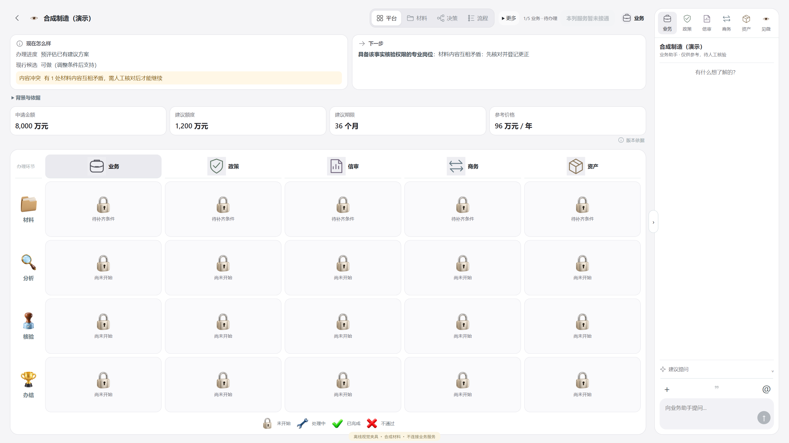

# V0.6.0 · 真实 API 与简洁交互修复验收

2026-10-05，Codex 独立验收。用户直接授权 Codex 亲自修复、简化前端并更新 Git。**本次列明的实现修复与三例已知回归通过；整体产品仍为 PARTIAL。** 不把模型成功返回、人工采纳、正式审批、部署和用户视觉验收混为一项。

## 实际修改

- 原件解析识别明确的 true/false；识别仅改变数据类型，申报不会因此升级为已核验。兼容旧解析信封，版本为 `parse-adapters@2.2`。
- 租金按真实单位计算，未提供单位保留未知，不默认“万元”；多条声明不冒充独立报价，单价不能写“已择优”。布尔存在声明不再冒充远程画面观察。
- 五区依赖提取原件声明并绑定实际解析材料；`column-deps-v2` 保证更正/核验等级变化使相关结果过期。语义输入严格限于本区依赖。
- 五区确定性结果先提交，再以最多四路并发取得只读语义建议。网络等待不占业务事务锁；返回后重新核客户、候选、材料和反馈版本，过期输出不写成当前结果。
- 同请求内存去重与持久 claim 防止重复出站；重启回放终态。残留 intent、超时及发送未知不盲重发；不同客户或输入复用 ID 返回冲突。
- 已存的 UNKNOWN 可以对账为原请求随后取得的终态，防止永久卡在未知；晚到的 UNKNOWN 不能覆盖已取得的终态。该对账仅查同一请求，不新增出站。
- `set_aside` 后允许本区新尝试，反馈进入新版本语义输入。等待补证仍能取得只读核验建议，但采纳门不放开。
- 获准原件片段公平分配，较长的第一份材料不能挤掉后面的流水。提示词优先承接具体金额、偿付压力、口径差异和入账性质，明确未核验。

## 真实调用与速度

只用既有官方 `https://api.deepseek.com` / `deepseek-flash` 配置与批准的 66hash 合成原件；每次发送前实际 readFile、全 SHA256 和字节数核对。未上传私人客户资料、未新增凭据、订阅或模型。

本次个人修复累计 **56 reserve / 56 actual，pending=0，actual 重复=0**，其中助手 6 次、五区语义 50 次。包括基线和有实际整改收益的版本试跑；不是一晚上新增量，也不是 56 次独立正确性样本。最新版本为 **19 次可用回执**：助手 v3 三次＋语义 v3 十六次（十五区＋I16 搁置重选一次）。三例最终并发重放没有增加模型调用。

| 实际范围 | n | 延迟中位数 | P95 | 最大值 |
| --- | ---: | ---: | ---: | ---: |
| 最新助手辅助观察 | 3 | 2.417 秒 | 2.672 秒 | 2.672 秒 |
| 最新五区语义单次调用 | 16 | 2.604 秒 | 3.543 秒 | 3.543 秒 |

| 合成案例 | 确定性五区就绪 | 含五区语义完成 | 重复推进 / 语义回放 |
| --- | ---: | ---: | --- |
| I07 | 1.307 秒 | 6.030 秒 | 均通过，无新增出站 |
| I12 | 1.145 秒 | 5.975 秒 | 均通过，无新增出站 |
| I16 | 1.155 秒 | 5.756 秒 | 均通过；新搁置反馈产生新业务区尝试 |

这些是本机、小样本、非长期压力测试。助手基线三次平均 1.740 秒，新版三次平均 2.417 秒，输出信息更充分，**不能称助手提速 1.5 倍**。用户的 1.5X 暂按加快交付节奏执行，没有改动语音播放设置。账本 `billKnown=false`，金额为 **UNKNOWN，不称免费**。

## 正确性与原件

冻结计划见 [PLAN](API_REPAIR_20261005_PLAN.json)，逐请求摘要、输入 hash、延迟和检查结果见 [RESULTS](API_REPAIR_20261005_RESULTS.json)。这是已知问题回归，Gold 已知，不是新的盲测或泛化准确率。

| 样本 | Codex 核对的实际结果 |
| --- | --- |
| I07 | 助手明确 400000 元关联方借款不是营业收入；205000 元申报现金流与拟合计 230000 元支出的 25000 元差额保留“若叠加”条件。引用绑定批准原文。 |
| I12 | 助手和信审语义指出 90000 与 106000 的 16000 元申报口径缺口；助手指出比例指标误填 CNY 的原件单位异常。未升级为核验结论。 |
| I16 | 助手保留“若同口径”与申报未核实，没有编造实质材料冲突或批准。实际 HTTP 搁置反馈后产生新尝试、r1 语义与空采纳状态。 |

9 条助手观察均为 `source_bound`；语义服务在成功前校验候选 schema 与材料/规则引用集合闭合。引用闭合仅证明所引用来源在输入范围内，不证明推论正确。语义部分措辞仍需人工复核：I07 前两项强调等级不足不可形成覆盖结论，随后给出条件性的申报差额；I12 信审复述了原件比例的 CNY 单位而未主动解释单位异常。该类语言一致性和更大盲测覆盖继续为 **PARTIAL**，不能宣称“所有回答完全准确”。

复现材料仅发布四份批准的合成原件与其 manifest，hash 不因 Git 换行转换而改变。原材料均以 unverified 登记；未伪造确认。既有真实测试客户、主库、历史与原夜间 PARTIAL 报告保持原状。

## 前端

参考 [Apple HIG 的视觉层级和按需展开](https://developer.apple.com/design/human-interface-guidelines/layout)，保留原产品的五区四阶段与人工决定路径：

- 一排短导航＋线性专业图标，角色卡片直接标专业名称。
- 状态、下一步分卡；金额、期限、价格各自成卡，避免重复金额说明。
- 风险与待核验信息保持可见；背景、版本依据和建议问题按需展开。
- 助手回复分“发现 / 待核验”，显示“未代替人工核验或批准”；点建议仅填草稿，显式发送才调用模型。
- 六专业标签可用方向键、Home/End 切换；抽屉焦点进入、Escape 关闭及助手折叠通过验证。

独立 dev-only 合成夹具、不连接业务服务。实际 CSS viewport 为 1920×1080 和 1366×768，保留用户既有缩放；原始截图因此是更大的物理像素尺寸。四页共享卡片未越过助手边界。1920 看板完整可见，1366 看板内部可滚动，材料/决策保留画布平移。图示为离线夹具，不是模型实时业务页面或用户视觉接受。

## 验证

- Front 最终 **265/265**，typecheck、build 通过；增加键盘切换、建议草稿零出站、观察/核验分组与权限提示的行为检查。旧角色测试的位图文件名断言改为用户已要求的可见角色名与符号，身份/权限断言保留。
- Edge 助手/证据/缓存/HTTP 相关 **47 项**、投影与解释 **10 项**通过。公平证据装配、未知回执、引用与上下文检查有覆盖。
- C/B 五区及解析/依赖相关回归通过；最终依赖 **10 项**通过，覆盖声明类型、单位缺失/混合单位、全部来源、解析信封失效与输入范围。
- A typecheck、新语义去重/未知测试、新真实 HTTP 流程测试通过；隔离 PostgreSQL 上 advance-round 10、parallel-arrows 14、column-step 1、execution-chain-02 18 项通过。
- 旧 D6 测试调整为已接受的“同 ID 恢复幂等下游”契约：保留仅一条人工决定与不同 ID 冲突检查，不以旧模拟器每次都丢回执冒充产品失败。
- 首次真实 HTTP harness 使用了错误的查询路径，两个模型调用已成功但观察等待超时；纠正 harness 后重跑独立客户，原失败证据保留，不计为模型运输失败。

测试与回执原始日志保存在 `.local/v06-real-load/codex-api-repair-20261005/`，不含凭据的公开摘要入 Git。未运行会重启共享 PostgreSQL 的 blanket A/crash suite，也没有为重复已有证据再发模型请求。

## 发布与未决

发布目标为 `main` 与新 tag `V0.6.0`，包含实际源码与重建 `Front/dist`；原基线为 `f0b4df9`。不部署、不重启保护的 48411/48431/48491、48511/48531/48591 共享栈，已有进程尚未重新加载此版本。

**D9 整体 OPEN**：本次只验与修复有关的并发/事务/过期路径，不代替完整 Kernel 锁等待与全部负对照。D6 仅继承已接受的小范围。商务 **HUMAN_SELECTION_REQUIRED、L1/L2、共享角色制度仍 BLOCKED**，净收益和金融学习未因此闭环。生产身份、长期可用性、真实外部支付、盲测泛化、用户视觉接受尚未完成。
