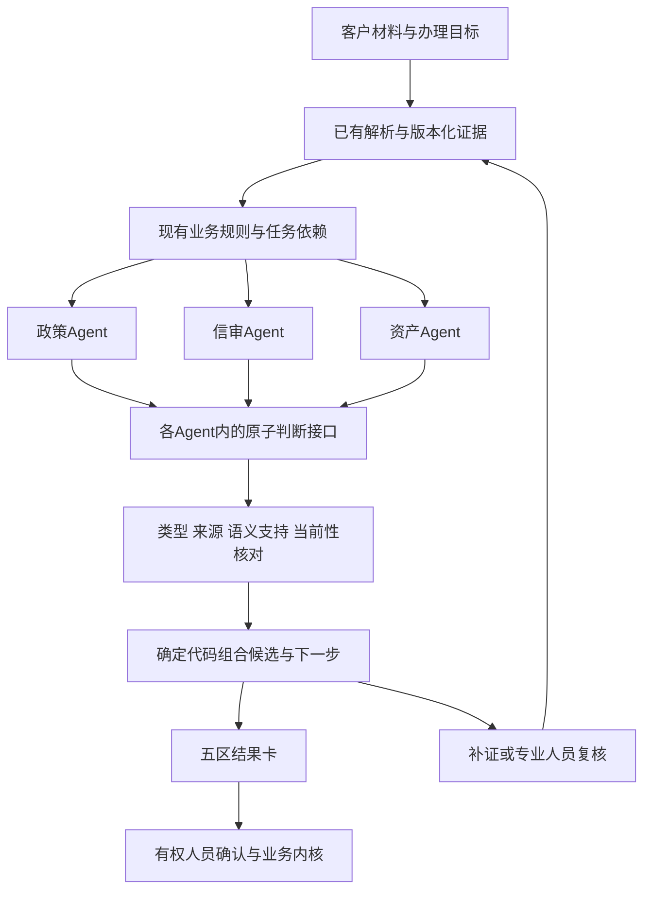

# TypeSafe / System One / Jev：全网研究与JW融合建议

研究日期：2026-09-20。状态：公开资料研究＋当前源码只读核对；未调用Jev、未做本地模型性能实测、未修改业务代码。AGI产品定位及用户追加的置信度点选反馈理念已写入[固定北极星1.4](../01_FIXED_NORTH_STAR.md)；本文的接口、阈值、实施顺序均为建议，交CTRL按单writer规则吸收。

**结论：JW应把“原子化结构化判断＋代码组合＋不确定性分流”吸收为专业Agent的工作方式。保留AGI任务理解、跨区协作、工具执行、纠偏续办的建设方向；Jev可以成为其中可替换的快速判断组件，不能独自承担整套系统。当前优先蒸馏设计，不把接入某个新模型设为完成产品的前提。**

## 1. 检索范围与证据等级

本轮检索覆盖中英文全网搜索、官方发布文/宣言/文档/评测、官方LLM适配器、第三方原始评测仓库、中文生态索引及开放模型实现。关键词包括TypeSafe Jev、System One Models、RLCD、calibration、benchmark、中文实测、openjev、SDK等。技术结论落到官方原文或作者自己的实验/代码，不以转载次数证明真实性。

“全网”是检索范围，不代表互联网资料已穷尽。截止本日，未查得足以复现Jev专有架构、训练数据和RLCD完整训练过程的官方公开材料；未取得JW账户访问资格、国内链路延迟或中文租赁数据上的性能证据。访问文档索引llms.txt失败后，已沿官方页面链接读取关键资料，不把无法访问的页面算作已核实。

证据分层：A=官方公开接口/说明；B=厂商实验主张；C=独立作者公开实验或实现，本轮未复跑；D=针对JW的工程推论。文中明确区分。新闻、聚合页、社交讨论只用于发现线索；不作为架构细节或模型性能的最终依据。

## 2. 它到底是什么：逐条蒸馏

| 项目 | 其含义与公开边界 | JW应该吸收什么 |
|---|---|---|
| TypeSafe | 公司与服务平台；System One是其模型类别名称，Jev是首款公开模型。不是TypeScript的类型系统，也不是工作流平台 | 区分产品AGI系统、Agent、编排和底层模型，避免名词混用 |
| Machine-native interface | 输入state和预先定义的问题，返回机器可消费的值 | 为专业判断建立版本化契约，减少从聊天长文猜动作 |
| Choice | 从给定选项中选择，提供选项分布与confidence；最多255项 | 材料类别、问题归属、有限候选证据选择；需要“其他/未知/不适用”，避免强行选中 |
| Score | 对具体等级描述评分，返回等级分布与期望位置；最多10级 | 单维度问题严重度、补证优先级；不把分数当金额、额度或违约概率 |
| Noul | 对命题返回0–1数值，不附独立confidence字段 | 狭义语义判断，如“文本是否提及权属争议”；不替代已核实事实 |
| Atomic questions | 复杂问题拆成一个问题一个维度 | 不直接问“这个客户该不该批”，分别识别材料冲突、经营收入解释和资产争议 |
| Parallel questions | 官方称同一state上的问题独立并行求值 | 同权限、同材料版本、互不依赖的问题成组；不把整个五区上下文塞入一次请求 |
| Composable decisions | 判断结果交代码组合成流程分支 | 硬规则、依赖和副作用留在业务内核，模型输出候选 |
| RLCD | 厂商提出的Reinforcement Learning for Calibrated Decisions，以决策概率校准为训练目标 | 吸收“概率必须接受检验”的原则；本次是设计蒸馏，不是权重蒸馏、训练或复现RLCD |
| Uncertainty routing | 概率与确定程度参与分流 | 缺证据→补证；冲突/复杂→专业人员或已获准推理模型；正式决定始终走人类权限 |
| Speculative fan-out | 可在一轮中提前问潜在分支问题，由代码决定哪些答案适用 | 仅对便宜、合法、确实可能用到的独立问题采用；不用错分支结果，更不预执行签约等动作 |
| Hybrid system | 生成、精确计算、语义判断各有职责 | 将长文解释移出关键办理路径，按需生成，并引用同一决策记录 |

以上接口语义来源：[官方介绍](https://docs.typesafe.ai/introduction)、[Choice](https://docs.typesafe.ai/primitives/choice)、[Score](https://docs.typesafe.ai/primitives/score)、[Noul](https://docs.typesafe.ai/primitives/noul)、[RLCD说明](https://docs.typesafe.ai/introduction/machine-learning-primer)、[fan-out](https://docs.typesafe.ai/patterns/fan-out)。这些是接口与设计主张，不构成JW的已实现能力。

关键细节：**独立求值不等于统计独立，也不保证多个答案在逻辑上相容。**同一命题及其否定分开提问，返回值不保证互补；不同问题类型的阈值不能直接通用。金额、计数、日期和跨答案一致性须由代码处理；模型还可能受无关长上下文及恶意材料影响。[官方已知弱点](https://docs.typesafe.ai/model-jaggedness/jev-1.13)

## 3. 对性能、概率与“零幻觉”的核查

1. **速度和费用确有吸引力，但倍数是有条件的。**发布文给出70–500ms以及特定工作流中的高倍数优势，同时承认测量地区、输入长度、比较方法和团队选题的影响。这些不能转成“JW快200倍”的宣传。[发布原文](https://typesafe.ai/blog/introducing-system-one-models-and-jev)
2. **类型合法不等于事实正确。**预定义选项可以避免生成不存在的选项，却仍会选错已存在的选项。引用ID合法也不证明该段材料支持结论。JW须分别验收格式、来源、语义支持和业务动作。
3. **confidence不是“客户可靠率”。**官方说明它由答案概率分布计算而来，与最大选项概率并不相同；当前该页未公开其具体计算公式。概率、confidence、材料完整度、真实标注上的校准表现应分别保存；不能混成一个可信度百分比。[Confidence](https://docs.typesafe.ai/confidence)
4. **官方评测的reference不是人类业务真值。**其四类工作流用两个强模型回答的平均值作参考，固定工作流比较成本、时间和参考一致性；不是中文融资租赁审批准确率，也不能证明工作流本身正确。[官方评测方法](https://evals.typesafe.ai/)
5. **第三方结果并不一致，恰好证明必须本域测试。**以下均为作者报告，本轮只读核对，未独立运行。

| 原始研究 | 实际观察 | 对JW的启示 |
|---|---|---|
| [jev-benchmarks](https://github.com/AbdelStark/jev-benchmarks) | 300条pilot中，不同数据集的准确率与校准表现差异明显；DAIR Emotion上Jev更差校准。作者承认阈值在同一pilot选取和评估，不能直接部署 | 信审、材料分类、意图识别分别测；阈值校准集与验收集分开 |
| [jev-phishing-bench](https://github.com/anisselbd/jev-phishing-bench) | 直接最终判断仅62.6%；拆成信号再组合后，独立半集的回归达到95.0%，规则对照91.8%。作者补测同样拆解的LLM，未证明Jev质量显著更优 | 优先验证“拆题有没有价值”，不能把流程优化全归功于换模型；其合成邮件数据不能外推信审 |
| [typesafe-ai-benchmark](https://github.com/iammrduncan/typesafe-ai-benchmark) | 合成场景成功请求P50：Jev176ms，快速结构化LLM215ms；不同场景各有胜负，部分状态轨迹会分叉 | 与精简后的同任务LLM比较，避免只拿长思考大段输出当慢基线 |
| [Janus](https://github.com/FirasSX914/Janus) | 项目设计区分带人工标签的数据与无真值的决策日志；不提供全场景固定阈值 | 建立自己的错误预算与覆盖率曲线；有模型一致性不能写成准确率 |

不采用“比所有LLM更聪明”“绝不幻觉”“概率天然代表风险”“多个模型投票就是真值”等结论。

## 4. 真实接入条件、开放生态与当前取舍

截至研究日，官方列出`jev-1.13.0`，文本输入，单请求总计64k token且state加最长问题32k；输入价$0.042/百万token，输出不计费。英文是主要训练语言，中文等语言效果须实测。版本别名会漂移，验收应固定版本并保留服务实际返回的版本。[Models](https://docs.typesafe.ai/models)

这些上限不是推荐每次填满的目标。JW宜保持短的角色证据包；PDF、表格、图片先沿已有解析链处理。Jev不能直接解释图片、生成任意长文或自由抽取所有字段；有限候选选择才适配其接口。

官方提供HTTP API及Python、JavaScript/TypeScript SDK，JW无需为接入额外创建Python服务。SDK默认重试，接入前必须让重试服从现有发送/回执语义，不能多层重试。先复用受控transport、预算账本、provider profile和未知回执保护。[Quick start](https://docs.typesafe.ai/introduction/quickstart)、[Client SDKs](https://docs.typesafe.ai/sdk)

官方称不使用客户请求/响应训练，并提供企业ZDR选项；“不训练”不等于所有账户默认零留存。本次没有申请账号、传输客户材料或购买服务。[数据处理入口](https://docs.typesafe.ai/legal)

| 路线 | 公开依据 | 本项目判断 |
|---|---|---|
| 现有获准模型＋原子问题契约 | [官方System One Adapter](https://github.com/typesafe-ai/system-one-adapter-python)本身也支持用LLM模拟同形接口 | **优先。**保留Node/TS，以严格校验和短输出试验；普通LLM自报概率不得标成RLCD校准概率 |
| Jev原生服务 | 官方API、版本与文档可查；访问与本域效果未验证 | **候选。**获准后与上述同题同材料比较，通过再作为可切换profile，不阻断主线 |
| 开放模型实现同形接口 | [openjev-sglang](https://github.com/ekzhang/openjev-sglang)使用Qwen与首token概率，并非Jev权重；其当前示例包含B200部署 | **暂缓。**不能把“开源/只输出选择”直接称作轻量、等价RLCD或本机零成本 |
| 大规模自训、知识图谱、多套Agent后台 | 不是吸收上述接口设计的必要条件 | **本轮不做。**缺乏专门训练数据、算力收益证据，且增加维护成本 |

开放复现、包装API和真正Jev必须独立标识。官方适配器的概率归一化或重试只修复接口行为，不自动校准概率。不开新数据库，不照搬第三方部署脚本，不安装无关plugin。

## 5. AGI定位与TypeSafe的关系

用户冻结：**JW做AGI，以制造业小微客户服务为当前落地场景。**TypeSafe的宣言强调让智能成为可组合的软件能力，且不追逐不断移动的AGI定义；因此本项目AGI定位来自用户，不能借其宣言证明“Jev就是AGI”或“JW已实现AGI”。[TypeSafe Manifesto](https://typesafe.ai/manifesto)

我们应保留两层职责：系统围绕客户目标理解与组织任务；每个可控步骤尽可能由小判断和确定代码可靠完成。一个固定Choice接口不是整个AGI系统；多Agent数量也不是通用性证据。TypeSafe官方甚至明确把其接口设计为软件中的判断原语，而非自行选行动的Agent，这与JW的交叉点在Agent内部判断层。[系统设计说明](https://docs.typesafe.ai/concepts/how-to-build-with-system-one)

建议用以下可观察能力承接AGI目标：

- 对未预置的新客户材料和新表述仍能完成同一任务，展示输入而非只切换案例标签。
- 五区共享有版本的事实，根据依赖分解工作并调用获准工具；依赖满足后继续执行。
- 证据矛盾时指出冲突，提出具体补证；补证改变结论时只更新受影响部分并解释变化。
- 人工纠正进入有来源、有版本的经验候选，经评测接受后复用；不自动改制度或在线自训。
- 同客户跨融资轮次保留历史，并正确区分当期事实和历史决定；正式权威始终属于人。

这些是工程验收方向，不足以单独证明任意领域通用智能。业务对象、收入红线、利润目标与五区范围保持北极星原约束。

## 6. 与JW五区的具体交叉点

以下为D类建议，不新增任何业务审批政策。

| 五区 | 应拆出的语义判断 | 确定代码/正式人员负责 | 页面应直接回答 |
|---|---|---|---|
| 商机 | 客户意图、材料类别、下一项需澄清的经营信息 | 已核实收入的单位/期间统一与去重；5000万元红线按现有北极星执行，未知收入不得猜成合格 | 适配范围是否明确？缺什么才能继续？ |
| 政策 | 当前条款与事实是否相关；例外表述是否出现 | 政策版本/生效日期/硬限制；解释争议由专业人员确认 | 适用哪条政策？哪个条件待核实？ |
| 信审 | 收入说明与流水用途是否冲突；哪项推断缺直接证据 | 金额核算、重复交易识别的确定部分、业务风险门和正式结论 | 关键风险、支持/反对证据、具体补证动作 |
| 商务 | 客户诉求分类；条款偏离类型；已批准候选方案的匹配线索 | 利息、费用、资金成本和期限计算；价格、额度与签约权限 | 可比较方案、差异、待谁确认 |
| 资产 | 有限候选间的设备描述匹配；文本是否提示权属争议 | 原件核验、唯一标识、估值依据及有权人认定；现场/图片事实须真实取得 | 哪台资产、缺哪份核验、是否阻断 |

见微助手承担解释、跨区摘要和下一步导航，不成为第六个业务区或第二个审批中心。履约、结清、返单沿已有生命周期契约逐段延伸；不得把辅助判断改名后直接当作结清凭据。

## 7. 当前源码落点与缺口

核对对象为当前在制工作区；本轮未启动服务，以下是源码事实，不代表运行和用户验收。

| 文件 | 当前事实 | 建议局部变更 |
|---|---|---|
| `Back/Edge/src/assistant-model.mjs` | 六助手ID，组装服务端上下文，主要请求observations/questions/evidenceRefs；有证据包、身份摘要和持久回执 | 新增独立typed-decision路径和问题版本；保留已有观察能力与authority=none |
| `Back/B/src/transport/glm.mjs` | 观察结果映射包含JSON解析，非JSON也有文字映射路径 | 新决策接口独立严格校验，不让自由文字或未知enum进入可执行候选；不粗暴修改所有旧调用 |
| `Back/B/src/graph/assistant-analysis.mjs` | 当前图是prepare→validate→model→citations→current→receipt六节点串行；调用方掌管持久回执 | 只在真实独立任务处加入受控分支/汇合；不能把现有串行图称作多Agent并行 |
| `Back/Edge/src/assistant-evidence.mjs` | 原件授权、版本与片段引用校验；最多8个片段，按字符预算裁剪并记录omitted | 按问题选证据并报告覆盖缺口；不可因被截断就认定不存在；来源绑定与语义支持分开验收 |
| `Back/Edge/src/assistant-receipts.mjs`及profiles | 已存在身份、回执和配置分离的复用基础 | 追加问题/规则/模型版本到身份；显式新分析有新运行ID，幂等点击复用同次回执 |
| `Front/site-mirror/app/takeoff/assistant-observation.tsx` | 当前为自由问题→等待完整输出→文字观察/待核验问题→引用展开，且核对当前性 | 在同五区板内加结果卡、补证/复核入口，复杂解释延后；技术回执留二级详情 |

在`Back/B/src`、`Back/Edge/src`、`Back/Connectors/src`定向检索未发现A2A/AgentCard命名证据；这只说明上述阅读范围没有提供落地证据，不能据此断言全仓库不存在任何相关实现。必须另以协议契约和真实任务交换验收。六个助手名字不等于六个独立协作Agent。

## 8. 建议的最小架构：轻、快、直观

图中三个专业Agent只是可并行片段的示意，商机和商务仍属于五区全链；J是复用的接口实现，不表示跨Agent混合上下文或另建中心Agent。A2A负责Agent间任务/产物交换，LangGraph负责依赖与恢复，原业务内核保留状态裁决。产品A2A要求继续有效；研究没有使用Codex内部subagent。

**轻量化：**保留单系统、现有存储和模型transport；问题定义、候选答案、规则版本作为小型契约维护。同一规则能精确计算就不消耗模型。五区共享事实引用，每个Agent只读取获准且相关的片段。

**快速化：**先做确定检查；同Agent同快照的独立问题合批，跨Agent按依赖有界并行；避免每个字段一次串行调用。不是所有助手每次全部重跑。生成长解释按需触发，成功结果逐区展示，但只有满足依赖、版本和权限门才能继续正式业务。

**直观化：**沿用五列四行和六助手，每个工作项默认只显示“当前结果／依据／缺什么／下一步与负责人”；展开才看选项分布、原件、版本和回执。显示“需补经营流水说明”比“confidence 0.63”更能指导工作。绿色仅用于真实办结，模型建议不因高分变绿。

**三种运行身份必须区分：**读取历史结果不发新调用；同一次提交的重复点击按幂等复用；用户明确“重新分析”创建新运行身份并实际执行。显式重跑与重复提交不能都靠相同内容hash处理。发送后结果未知时先核对，不能通过换问题、换助手或SDK自动重试重复计费。

## 9. 最小决策契约建议

不立即改公共API；先由CTRL冻结字段。下表是JW包装层设计，不是Jev原生字段列表。

| 部分 | 最少要保留的信息 |
|---|---|
| 输入身份 | tenant/customer、分析运行ID、专业Agent任务ID、材料版本、证据包hash、问题集版本、规则版本、模型profile/实际版本 |
| 原子问题 | questionId、类型、单一判断条件、候选项/等级描述、允许证据ID、缺证据时的处理、依赖 |
| 模型输出 | value、可选概率分布、可选provider confidence、概率来源与校准状态；LLM无法提供可靠概率时允许为空 |
| 证据关联 | 已存在且获准的引用ID；候选可引用不代表语义已核实，支持关系单列 |
| 执行状态 | 待执行/执行中/成功/失败/发送未知；与业务判断值分开 |
| 业务候选 | 可继续准备/需补证/有冲突需复核/规则阻断/不适用；不等同正式批准 |
| 审计与页面 | 成本、耗时、当前性、模型建议与人工动作、下一步、变更原因 |

Jev不生成自由文本引用和解释：可先由程序建立候选片段ID，再用受限选择或逐片段相关性判断辅助定位；无候选支持时返回缺证据。模板可依据结构化字段展示简短说明；如调用LLM补解释，须重新验证其引用和主张，不能把流畅解释当原模型的内部推理。

`Score`只是定义好的业务维度评分；多个分数的加权和仍不自动成为违约率。硬门不能被其他高分抵消。没有数据支持时不预设统一0.8/0.9阈值，不用相乘或平均制造“综合可信度”。模型分歧是复核信号，不是多数表决产生正式权威。

### 9.1 用户追加：人看关键数据，点选候选置信度，快速反馈学习

**已冻结的产品理念：人必须看的数据保留；同一抉择给3–5个有依据的候选，各带置信度，优先降序排列并默认建议首项；点选后立即纠偏并形成学习反馈。**下面是使该理念可实施的建议，不是已经交付的页面。

建议页面从上到下：

| 区域 | 内容与交互 |
|---|---|
| 必看数据 | 此判断相关的金额、期间、单位、证据原文、矛盾和缺件；能点击原件；不要求人工读所有无关后台数据 |
| 候选卡3–5项 | 每卡显示一个判断/方案、模型估计或已校准概率、最关键依据、执行后的影响；数字来源可展开 |
| 默认首项 | 规则和权限筛选后按同口径置信度降序；第一项标“建议首选”。默认状态记录为模型建议，不产生人工同意记录 |
| 一次点选 | 点击卡片或其置信度区域选择该候选，更新当前可撤销建议，显示哪些工作项因此变化；保留撤销入口 |
| 无合适候选 | “信息不足/均不合适”，可补证、改写目标或交专业人员；不足3项时不补造选项 |
| 正式动作 | 仍使用已有权限与确认流程。模型选项不是正式批准，点击数字不直接放款、签约或变更额度 |

例：面对收入材料口径差异，可比较“期间不同，需先统一期间”“同笔交易可能重复计入，需核对”“部分流水用途未证实，需补说明”等诊断候选。它们可能同时成立，因此**不能未经业务定义就放进一个互斥Choice并把概率凑到100%**。如果问题问“下一步优先做什么”，才能把这些补证动作作为同一选择空间比较，且需明确多问题仍可并存。金额差异的精确计算由代码完成。

默认排序依据须透明：用户要求按置信度排序时，只有语义与口径可比的候选才放在一起；同分用稳定顺序。风险红线和权限先筛，不能让“最确信会违反制度”的选项成为可执行首选。未知或未校准明确标示；置信度未提供时不能伪装成降序百分比列表。已有人选定的卡片保留选定状态，证据改变时提示重新核对，不自动切回新的第一名。

快速学习分三层：

1. **本次立即生效：**将点选作为当前任务的人类纠偏输入，保留模型原排序，只定向更新受影响候选/工作项。若是判断事实，需要相应证据；用户个人偏好只改变允许的推荐维度。
2. **反馈可恢复：**记录feedbackId、操作者与权限、客户/任务、输入证据hash、问题与候选版本、原排序/分数、选择ID、可选理由、时间和最终业务结果。反馈可撤销/纠正，跨客户/租户的经验共享必须有明确范围。
3. **后续有证据地改善：**先将反馈作为经验候选，按人工验证标签调整问题描述、例子、路由或排序；校准与验收使用独立数据，接受后形成新版本，可回滚。不将“选了第二项”直接等价为“第一项事实错误”，不直接重标全部概率或在线修改模型权重。

这与TypeSafe的交叉点是保留完整候选分布并用于交互；**点选式人机学习闭环是JW要补上的产品能力，不能宣称Jev API自带点击学习。**官方说明Jev当前不按客户数据进行fine-tuning/LoRA，业务适配主要发生在请求内容与问题定义层。[Models](https://docs.typesafe.ai/models)

验收最少覆盖：默认首项未产生人工审批；选择次项后定向变化且可撤销；无有效候选能退出；数字缺失/未校准显示正确；材料变化不沿用旧概率；人工选定不被重排覆盖；反馈按客户权限隔离；一次错误点选不污染其他客户；后续版本改善有独立样本结果，不能只展示“已学习”动画。

## 10. 怎么证明真的更轻、更快、更好

先建立两组核心对照：同获准模型的现有观察路径，与原子化结构化路径；再加入规则对照。这样能分离流程设计收益与模型替换收益。Jev具备访问/数据/预算授权后作为额外实验臂，不作为第一步依赖。人工作业基线另测以支撑利润因果链。

| 维度 | 测量方式与边界 |
|---|---|
| 业务正确性 | 按问题与动作记录错误、遗漏、错误放行/错误阻断；金标准由专业人员结合原材料确定，模型一致性另列 |
| 来源与支持 | schema有效率、引用存在率、原文真正支持结论的比例；三个指标分开 |
| 不确定性 | 有概率时测Brier/ECE、可靠性分箱和误差预算下覆盖率；保留样本数与区间，阈值在独立校准集确定 |
| 速度 | 上传/解析/取证/模型/校验/呈现分段耗时，P50/P95、失败和超时；缓存命中与新调用分开 |
| 成本 | 每成功且业务可用结果的总成本，包含失败、重试、生成解释、人工补救和运维；未知费用单列 |
| AGI方向能力 | 新表述/未预置材料、跨区依赖、工具调用、补证纠偏、历史轮次隔离与经验版本化，不以固定演示路线代替 |
| 故障与权限 | 越权材料、陈旧版本、冲突证据、恶意文内指令、超时未知、重复点击、模型版本变化、单Agent失败 |

好/中/差三例用来证明路径正确，再为每例设计缺件、相互矛盾、单位错误、过期政策、同名不同设备、正文后部关键证据等变体。原始客户及其变体必须整组分到同一数据划分，避免泄漏。三个案例不足以校准概率或证明全国适用，不能通过扩写同一个案例假装独立样本充足。

组合系统耗时约为“共享准备＋关键依赖路径＋校验落库呈现”，不能把单次模型延迟当全流程速度。并行使等待接近最慢分支，但排队、限流和失败恢复可能抵消收益，必须测端到端。

价值记录继续使用北极星月/季/半年/年度口径。人工工时减少首先是释放产能；只有实际支出下降或新增业务产生净贡献才计相应利润，不与模型费用下降重复计入。

## 11. 实施优先级与停止条件

1. **先冻结一个纵向切片：收入材料矛盾识别→补证→受影响区续办。**准备具体问题、候选答案、证据和预期分支；核算仍用代码，专业判断仍由人确认。这条同时覆盖原子判断、跨区协作、证据纠偏与客户价值。
2. **用现有获准模型验证原子接口。**接在现有transport和回执之上，严格输出契约、最小证据与同题对照；这是推荐的下一项To Do，不在本次研究中实施。
3. **扩展五区与真实A2A分工。**同一契约、独立任务上下文、按依赖并行、局部续办；先冻结公共接口，再分文件写入，最后串行装配。前端只消费真实结果。
4. **条件满足后比较Jev。**先测中文分类/矛盾判断，达成预先约定的错误预算、速度与成本要求才纳入可切换profile；版本升级重新校准，不追随latest自动迁移。

停止新增复杂度的条件：结构化路径未带来可用结果成本或端到端耗时改善；错误放行超出预设预算；需要新数据用途/费用授权；无法保持证据、权限、当前性；新架构要求另建系统或大范围重写。停止的是该优化/接入试验，不是擅自取消北极星目标。

本报告不自动派发新任务，不接管CTRL或正在写代码的任务；建议由用户通过CTRL先确认上述唯一切片，再按最新实施分工执行。

## 12. 补充来源导航与本轮交付

以下为已检索的补充线索，未拿聚合页的数字作为性能结论：

- [中文生态索引](https://github.com/yzfly/awesome-jev-zh)：发现开放实现及非英语评测线索。
- [应用与模式索引](https://github.com/anil-matcha/awesome-jev-by-typesafe)：发现路由、证据筛选、护栏等应用；目录收录不代表项目验证。
- [官方发票工作流](https://evals.typesafe.ai/invoice_processing)：与单据匹配/异常分支有关；不能复制成租赁审批政策。
- [官方模式目录](https://docs.typesafe.ai/patterns)：fan-out、confidence routing、composite scoring、intent routing。
- [原作者对参考标签的审查](https://counterproof.io/notes/typesafe-jev-benchmark-consensus-labels/)：提示参考模型会相互分歧；本文采用官方方法本身确认的局限，不依赖其二次计数。

本轮交付：本研究；北极星1.4的AGI定位及置信度点选反馈冻结条款；根部入口的版本指针同步；DECISIONS/CHANGELOG记录。写入前备份：`.local/typesafe-jev-research-20260920-204253/`。恢复时先比较当前文件与备份，只撤销本次条款/指针，不覆盖其他任务后续修改。未改Front/Back源码，未运行收费推理、安装SDK、提交或发布。后续实现、性能验收与用户视觉验收均未完成，不能因本文交付而标记产品完成。
