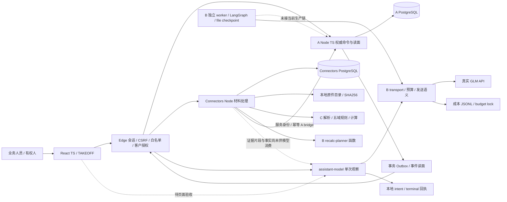
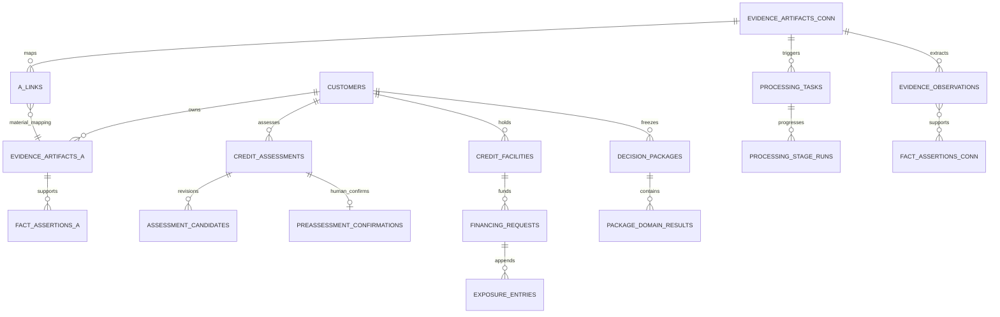

# V0.3 技术架构与调用链核对

版本：TEC-20260920-1｜作者：V0.3-TEC｜性质：源码核对与契约候选，非产品验收。

依据：[00_AUTHORITY](../00_AUTHORITY.md)、[TASKBOARD](../TASKBOARD.md)、[SOURCE_REVIEW](../SOURCE_REVIEW.md)。评分固定 S1创新20 / S2融合20 / S3提效20 / S4完整与速度30 / S5呈现10。工作区存在并行修改；下列行号对应本次读取，最终哈希见 `SOURCE_MANIFEST.json`。Front 页面由 FRONT 独占，后续变化须由 EVAL 冻结复核。

结论：现有可复用骨架是 **React 页面 → Edge → A 权威内核 / Connectors 材料处理 → PostgreSQL + 原件目录**。C 的解析、计算和五域规则是确定性代码；真实 GLM 通过 Edge 复用 B transport 单次观察，尚未消费材料原文和事实明细。B 的 LangGraph 执行器确实存在，但没有进入当前 TAKEOFF 上传或真实观察主链。全周期仍缺独立轮次、合同及分期履约契约。

## 1. 证据等级

- **接线已核**：沿入口、调用、实现、存储读写核对可达；不等于本任务运行成功。
- **存在未接**：实现或端点存在，但当前页面/启动主链没有接通。
- **未实现**：本次限定源码与迁移未找到目标能力；不是断言仓库历史中绝无原型。
- **执行者自报**：引用已有报告，TEC 未重跑；**独立运行**归 EVAL；用户视觉验收另记。

本任务零真实模型调用、零数据库写测、不启停共享服务，不读凭据文件。

## 2. 当前架构（实线=源码接线，虚线=存在未接或待补）

这里的 B recalc-planner 是被 import 的普通模块，不能讲成 B worker 已在线。当前 C 也是 Connectors 进程内导入模块，不需要为规则链另起 C mock HTTP 服务。`takeoff-up.mjs:189,289,344` 装配 A、Connectors、Edge；`Connectors/scripts/start-connectors.mjs:86` 启动处理驱动。

## 3. 按钮到持久层

源码路径均相对 `C:/Users/22673/Desktop/JW/`，可用编辑器按行定位。

| 页面动作 / 结果 | 前端位置 | Edge → 下游 → 持久化 | 当前裁决 / 评分 |
|---|---|---|---|
| 进入真实办理 | `Front/preview/main.tsx:5`、`app/workbench/root-app.tsx`（均在 Front 下，app 位于 site-mirror） | `Edge/src/server.mjs` session 路由 → 服务端身份映射 → A 凭据认证 | 接线已核；生产身份不由角色选择器证明。S4/S5 |
| 客户目录 / 工作区刷新 | `Front/site-mirror/lib/workbench/wb-client.ts`、`use-workbench.ts` | Edge `kernel-store.mjs:270-405` → A 客户、材料、评估、依据包读面 → `customers/credit_assessments/...` | 接线已核；清单 limit=100，非穷尽时有 notes，不可将窗口当完整台账。S4 |
| 上传进处理链 | `app/workbench/originals-panel.tsx:10` 引用 ChannelCard；`channel-card.tsx:115-140,300` | client.channelAction → `/api/jw/v2/actions/connectors/evidence/upload`，`Edge/src/proxy.mjs:169` → Connectors `/api/connectors/evidence/upload` (`http/server.mjs:174-236`) → FS 原件、`evidence_artifacts`、`processing_tasks` | 接线已核；当前页单件≤512KB，邀请绑定为前提，传输成功不代表分析成功。S2/S4 |
| 后台处理 / 五域进展 | 无另一个“启动AI”按钮，上传后常驻驱动推进 | `coordinator.mjs:795` 解析 → `900` 事实 → `1068` 五域分析 → `1570-1680` A bridge；C `parse/adapters.mjs`、`domains/pipeline.mjs`；B `schedule/recalc-planner.mjs` | 接线已核，确定性计算，非真实模型推理。S1/S2/S4 |
| A 材料与运行回写 | 页面读取处理进度 | `coordinator.mjs:687` 登记 metadata；`a_bridge.mjs:70,106` → A artifacts/analysis-runs/gate/findings，服务身份；`a_links` 保存跨系统引用与回执 | 接线已核；包域结果仅在 `aPackageDomainResults=true` 且存在相容包时写入；不自动产生正式授信。S4 |
| 预览原件 | `originals-panel.tsx:56-92` 读取 A artifactContent | A `credit.ts:640-676` 只返回 materialFile 或结构化 content；统一上传 A 登记 `coordinator.mjs:691-701` 明确不含原件字节。Connectors 已有 `http/server.mjs:347-368` 短时预览入口 | **部分断开**：A 信封老路径能显示；统一上传需通过 connectorRef 调受控预览，目前该面板未沿引用取字节。API存在≠此按钮闭环。S2/S4/S5 |
| 新建预评估 / 候选修订 | `proposal-panel.tsx:384,406-411` | Edge actions/customers/:id/assessments、assessments/:id/candidate → A `http/server.ts:160-171` → `credit_assessments/assessment_candidates` | 接线已核；候选由受控表单提交。处理链存在 amount_candidate，并未发现它自动进入 A submitCandidate 的调用。S2/S4 |
| 需求登记 | 初次核对 wb-client 尚无专用录入方法；FRONT正在补 | Edge `proxy.mjs:94` → A `/assessments/:id/admission-request` → `credit.ts:754-766`、migration014 | API已接；页面是否完成以 FRONT/EVAL 新报告为准。S2/S4 |
| “结束”确认预评估 | `takeoff-screen.tsx:264-298` | client.confirmPreassessment → Edge `proxy.mjs:89` → A `credit.ts:941-1139` → `preassessment_confirmations`、评估版本、审计/Outbox | 接线已核；版本、权限、候选依据、人类门；scope=preassessment_only，不写融资或敞口。S4/S5 |
| “客户简报” | 初次快照 `takeoff-assistants.tsx:137,240` | 读取 Connectors finalization → 本地 `takeoff-assistant-brief.ts` 确定性组答 | 接线已核；不是 GLM。FRONT新增入口另验。S2/S5 |
| 真实助手观察 API | 初次快照页面无调用 | Edge `server.mjs:363-437,607` → `assistant-model.mjs:102-171` → B `transport/glm.mjs:34,353` → GLM → 文件回执 + 成本账本 | 后端接线已核；报告自报真实成功，TEC未新增调用。输入缺证据详见下一节。S1/S2 |
| 正式额度、用信、出账、结算 | TAKEOFF `proposal-panel.tsx:6` 明确移除正式入口 | Edge `proxy.mjs:99-106` 保留 A endpoints → A `credit.ts:1764,1820` → facilities / financing_requests / exposure_entries | 实现存在、当前页未接；必须新契约和有权人。现 settle 是一次全额本金结算，不是分期租金或合同结清系统。S4 |
| 第二轮融资 / 单合同结清 | 当前页无明确轮次、合同选择器 | financing_requests 有多个记录、contract_refs JSON；迁移未见独立轮次/合同/还款计划表 | 完整目标未实现，不把第二次createAssessment当成第二轮合同生命周期。S1/S4 |

## 4. GLM 输入到底是什么

`Edge/src/server.mjs:390-410` 输入包含客户名称、assessmentState、inputVersion（或scope.revision）、候选版本/建议金额/期限/倾向、阻断数、五域到件数、用户问题。`evidenceRefs` **硬编码 `[]`**。`assistant-model.mjs:63-78` 将上述字段渲染为文本；不取 `parse_results.text`、`fact_assertions`、冲突事实、来源页/行，也不取申请用途、设备范围等完整需求。

因此模型可做“针对所见摘要提问”，不能据此验证原文中的企业名称、现金流、所有权或新旧事实差异。到件3份不等于3份已读；阻断数2不等于知道2个阻断的原因。`C/domains/pipeline.mjs:22` 标记 simulation + deterministic-extractor；`coordinator.mjs:1586` 登记 providerMode=deterministic_calculation。必须分别展示。

模型输出只返回观察和问题，不能直接进入 Gate/候选确认；当前 `glm.mjs:548-555` 可接收模型自报 evidenceRefs，但未校验它们属于实际输入。新增引用消费前必须服务端验证。

### 回执当前性缺口

- `assistant-model.mjs:110-133`：requestId由 customerId、contextVersion短hash、assistant、question短hash生成；重放terminal不比较 payloadHash，不含assessmentId、完整上下文hash、模型/提示词版本、tenant。
- `A/migrations/012_takeoff_preassessment.sql:5` 和 `credit.ts:520`：inputVersion只在被评估快照引用的原件被supersede时推进。候选修订、确认状态变化、需求修订、新评估均可能仍是0。
- 后果：同客户同问题在候选或状态已变时可能拿到旧观察，并把新payloadHash包装回响应。此为源码缺陷判断，独立反例由EVAL给出。
- 跨租户直接泄露不能仅凭少tenant字段认定：A customer_id全局唯一且路由先查客户权限；但回执仍必须绑定tenant+授权受众，避免迁移/恢复/多部署复用风险。
- LocalFileReceipts (`B/src/ports.mjs:50-68`) 的读后写不是单请求原子认领。原子文件rename保护文件完整性，不保证并发只调用一次。另一个实例的内存缓存可能保留intent；需要单请求锁与锁内重读，不能只靠预算lock。

### 既有真实报告可用到什么程度

`docs/takeoff/first-admission-v1/ZHIPU_API_ACCEPTANCE.md` 自报13次出站、10次成功、3次未知；v2六助手均成功；部分输出达到2000 tokens上限。TEC仅核对报告与相关代码，不将这些数字改记为独立测试。预算授权也仅见报告转述，本任务不使用该预算。费用、延迟、模型能力不从旧报告外推到新证据输入。

`Back/B/package.json` 当前 `npm test` 显式清单不含 `context-brief.test.mjs`，EVAL需单跑；不能继承“全套已含该测试”的措辞。报告建议删除成本账本以重置额度不可作为运维方案：账本保留，预算调整应单独版本化授权。

## 5. 现存表关系与数据权威

上图含逻辑引用，不声称每条都有数据库外键：如A snapshot、basis、contract_refs和Connectors引用多为JSON。A_LINKS是多态映射，图中只画material分支。A与Connectors是两个存储域，不存在跨库外键或分布式原子事务。

| 权威/存储 | 表 / 文件 | 来源与边界 |
|---|---|---|
| A 业务权威 | `customers/evidence_artifacts/fact_assertions/credit_assessments/credit_facilities/financing_requests/exposure_entries/decision_records/v2_idempotency` | migration002；金额整数分；正式权限矩阵缺失即阻断 |
| A 决策依赖 | `decision_packages/package_domain_results/decision_findings/analysis_runs/rule_gate_receipts` | migration004/006；证据快照、规则版本与运行盖章 |
| A 预评估 | `assessment_candidates/preassessment_confirmations`、admission_request | migration012/014；确认历史保留，不生授信效力 |
| A 工作与事件 | `goals/task_assignments/inspection_items/inspection_questions/audit_events/outbox_events/outbox_deliveries` | migration001/003；现有工作项来源不能误说成已统一全周期工作项 |
| Connectors 材料与执行 | `objects/evidence_artifacts/evidence_observations/fact_assertions/processing_tasks/parse_results/domain_analyses/analysis_finalizations/a_links` | `src/store/schema.sql:179-519`；原件字节在FS，DB保存引用/hash；输出是候选、规则计算或处理状态 |
| B / Edge 模型执行 | file checkpoints、receipts JSON、cost ledger JSONL | 执行状态与费用证据，不能代替A决定；当前单机文件存储需随备份一起保存 |

## 6. 技术答辩：能保证什么、还缺什么

| 问题 | 已有机制与源码 | 边界 / 下一步 | 评分 |
|---|---|---|---|
| 重复点击会重复批准吗 | `A/domain/v2kit.ts:115-165` 作用域幂等+payload检查；客户/设施/申请锁；migration007第二层账目唯一 | 按冻结EVAL反例证明，不能借此替模型回执并发背书 | S4 |
| 新证据会改掉旧结论吗 | `credit.ts:488-539` supersede链、stale/inputVersion/needsReview；候选修订留历史 | 旧确认保留，展示待复核；模型结果也须绑定完整上下文hash | S1/S4 |
| 只重算有关五区吗 | `coordinator.mjs:1120-1180` 按消费事实签名+来源材料检查复用，值同但来源变也重算 | 这是规则计算能力；AI新增价值须另做人工/规则/规则+AI三臂测量 | S1/S3 |
| 网络超时如何处理 | 模型 intent→terminal，发送未知不盲重发；A bridge通过原requestId查回执；`a_links`记状态 | 未知费用≠0，需对账；应用进程恢复不等于供应商未执行 | S4 |
| 队列和锁如何恢复 | Connectors租约+SKIP LOCKED (`coordinator.mjs:1712-1733`)，B worker fencing另有实现 | 两套执行范围不同；本轮不把B worker接线作为P0前提，避免扩大装配面 | S4 |
| Outbox是否exactly once | A业务变更和outbox同事务，dispatcher至少一次；消费须按eventId去重 | `dispatcher.ts:51-55` 以MAX(seq)补投递，晚提交小seq可能漏入；`CONTRACT.md:269`已承认事件水位问题。Edge回看128是缓解，不是全量不丢承诺 | S4 |
| 原件与DB是同一事务吗 | `objectstore/fs.mjs:20-29`先writeFile再写objects；get校验hash | **不是原子事务**。写文件后DB失败可留下孤儿；恢复须核对DB→对象hash和对象→引用清单，先隔离、不可自动删原件 | S4 |
| 数据库备份足够吗 | 既有`Edge/scripts/backup-restore-drill-v2.mjs`覆盖A关系/续办 | 脚本含DROP，只能EVAL自有隔离资源运行；全栈备份还要Connectors库、对象目录、模型回执/成本、消息文件、版本manifest。只恢复A不足 | S4 |
| 多租户靠什么隔离 | A `scopeByRow`、客户grant；Edge `channel-authz`逐资源裁决；Connectors查询tenant/customer | 迁移未见RLS策略，属于应用级隔离，不能宣称数据库级强隔离；生产身份和直接DB账号权限另验 | S4 |
| 文件很大怎么办 | 页面512KB、解析器显式拒绝加密/扫描PDF、图片转人工，ZIP防护 | 不声称通用OCR。先用材料组真实格式核验；有瓶颈证据再将同步解析迁到单独Node worker，不为语言占比加Python | S2/S4 |
| 为什么不接GraphRAG/A2A/Dify | 当前依赖是有限事实键、证据版本与业务事务 | 图检索、跨代理协议、外部编排平台没有明确收益证据；现栈已能完成需要测的最小闭环 | S1/S4 |

锁内复查与队列互斥采用PG现有机制；`FOR UPDATE`在并发更新后返回被锁定的新行，仍须固定锁顺序并处理死锁。[PostgreSQL官方锁文档](https://www.postgresql.org/docs/17/explicit-locking.html)

序列号不是提交水位，回滚也不会退回序列；因此不能用“bigserial连续递增”证明事件无遗漏。[PostgreSQL官方隔离说明](https://www.postgresql.org/docs/current/transaction-iso.html) 推荐整改方向是持久消费者投递记录/反连接补漏+eventId去重，并保留权威全量读；不贸然给所有业务事务添加全局串行锁。

LangGraph提供图状态checkpoint；本项目已有`runtime.mjs:85-117`和`task-run-orchestrator.mjs:15,69`的真实装配。官方能力不替代当前路径证明，也不自动提供外部API副作用恰一次语义。[LangGraph官方持久化说明](https://docs.langchain.com/oss/javascript/langgraph/persistence) 当前项目锁定`@langchain/langgraph 0.2.62`，上述网页用于概念核对，不据此擅自升级。

Node的同步CPU工作会占用事件循环，worker threads适用于CPU密集JS，不是所有网络请求都应加线程。[Node官方事件循环说明](https://nodejs.org/en/learn/asynchronous-work/dont-block-the-event-loop)、[worker threads说明](https://nodejs.org/api/worker_threads.html) 本轮先量解析时间和事件循环延迟，再决定是否分离；无必要新增运行时。

数据库RLS需显式启用和政策配置；表所有者等存在绕过语义。当前源码未部署该机制，不包装成已有能力。[PostgreSQL官方RLS文档](https://www.postgresql.org/docs/current/ddl-rowsecurity.html)

## 7. 现场可讲与不可讲

可讲：一次材料提交沿可追溯处理链登记；规则消费证据版本并定向重算；人工预评估确认有独立权限与依据门；真实模型观察已存在单独入口，当前输入能力受限。

待P0与EVAL通过后才能讲：模型读到授权合成片段并给可点击核验引用、上下文变化不会复用旧答复、规则+AI相对规则有测得的增益。没有完整合同/履约/结清/返单接口与页面证据前，只能把全周期列作目标和分期交付路线。S5主讲图用第2节，不把虚线改实线。
