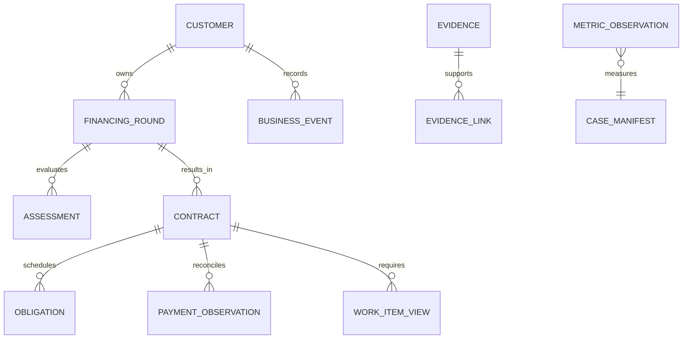

# V0.3 缺口、契约候选与十小时依赖顺序

版本：TEC-20260920-1｜仅提交CTRL裁决；不改总体目标。S1/S2/S3/S4/S5权重=20/20/20/30/10。

总目标仍是同客户五区协同到履约、异常、结清、多轮返单。十小时优先顺序只决定本窗口先修什么，不能把后续目标删除、把预评估重新命名为正式授信或把未实现写为完成。

## 1. 缺口排序与证据

| ID / 优先级 | 缺口与可复现条件 | 修复最小成果 / 依赖 | 验收、退出条件 | 评分 |
|---|---|---|---|---|
| G01 P0 | GLM只有摘要，evidenceRefs=[]；`Edge/server.mjs:390-410` | 授权合成材料的服务端ContextEnvelope，至少一项事实及来源原文片段；有效引用校验；依赖G02 | EVAL离线捕获出站body，逐字段对应manifest/原件；无授权或无合格来源则不发送。无真实调用也可验证结构，不可据此宣布模型理解质量通过 | S1/S2/S4 |
| G02 P0 | 同inputVersion=0，修改候选/状态/需求/评估后同问题仍命中旧回执；`assistant-model.mjs:110-133` | 完整effectiveContextHash、assessment/round范围、模型与prompt版本、授权受众；原子claim和锁内读回执 | 改每项相关输入新请求；不变输入重放零出站；撤权先拒；并发唯一出站；未知不重发 | S1/S2/S4 |
| G03 P0 | model evidenceRefs可自报，无输入集合校验；`B/glm.mjs:548-555` | 保持引用结构、服务端核验引用属于本次上下文且hash/位置一致；观察逐条关联引用 | 伪造/过期/跨客引用均标invalid并不能被当依据；无引用问题可保留为提问 | S2/S4 |
| G04 P0 | 统一上传原件在Connectors，材料面板仅取A信封；`ARCHITECTURE.md §3` | A connectorRef → Edge逐资源授权 → Connectors受控preview → 原件；FRONT独占页面 | 上传真实格式合成文件后能从引用打开同hash片段来源；未知格式明确转人工 | S2/S4/S5 |
| G05 P1 | 六助手按钮/需求录入未在初次源码快照完成 | FRONT消费已冻结接口、状态、受控观察与回执，不自动触发6次模型调用 | 页面错误、等待、unknown、陈旧、引用可见；以FRONT/EVAL新证据为准 | S2/S4/S5 |
| G06 P1 | 全周期对象缺口；contract_refs只是JSON；settle为全额本金 | 本文§3客户-轮次-合同契约候选与业务权限裁决；可先实现登记读面 | 两轮两合同并存，一份结清不关闭另一份或客户；不可借现settle声称分期履约 | S1/S4 |
| G07 P1 | Outbox MAX(seq)和事件水位不能防晚提交漏项 | consumer/eventId持久去重及补漏查询；权威重取兜底；独立A修复窗 | 事务晚提交、回滚缺口、超128乱序、消费者重启都不永久漏；并发测试仅隔离PG | S4 |
| G08 P1 | 全栈恢复闭环证据不足；FS和DB非原子 | A库+Connectors库+原件+回执/费用+消息+版本manifest；隔离恢复对账 | 关系/hash/重放/新写通过，恢复不发模型或资金；若仅A恢复则结论限A | S4 |
| G09 P1 | S3缺相同任务的人工基线；旧模拟数据易误用 | EVAL三臂同材料、同答案标准、同完成界限；分人工操作和总历时 | 未测值=null；报告样本n与失败/未知，不报泛化准确率或提效百分比 | S3/S1 |
| G10 P2 | A→B worker真实生产链未接 | 以后如需长任务再接lease/fencing/real回执契约；当前单次观察无必要迁移 | 在独立装配验证前仍标存在未接 | S4 |

P0是当前评分证据闭环最先需要的修复，不代表其余目标可取消。重大业务/范围/路线异议只报CTRL，由CTRL向用户裁决。

## 2. 受控证据上下文候选 TEC-CTX-1

CTRL已要求P0按“最小受控证据片段/事实上下文+可核验引用+有效上下文hash+规则/模型/人工职责”推进。下列是待CTRL集成到公共契约的候选，TEC不写Back/CONTRACT.md。

### 2.1 数据路径与最小响应

新增内网只读候选：`GET /api/connectors/analysis/model-context?tid=:tenantId&cid=:customerId&assessmentId=:id`。Connectors只输出其自身能证明的证据与事实，不判定A评估是否有效；Edge先用A鉴权并取评估，服务端选择范围，不能接受浏览器传入的facts/text/authority。Connectors解析ID与A artifactId必须通过已registered的a_links映射，禁止猜ID。

```ts
type ContextEnvelope = {
  schemaVersion: 'TEC-CTX-1';
  tenantId: string; customerId: string;
  assessmentId: string; roundId: string | null;
  assessmentVersion: number; admissionRequestRevision: number;
  candidateRevision: number | null; inputVersion: number;
  assessmentState: string; basisPackageId: string | null;
  basisRevision: number | null; rulePackVersion: string;
  processingSnapshotHash: string;
  disclosure: { audience: 'internal'; policyVersion: string };
  dataClass: 'synthetic'; materialManifestHash: string;
  exportAuthorizationRef: string; // 服务端获准配置，不能让浏览器自报
  facts: Array<{
    factId: string; key: string; value: unknown; unit: string | null;
    period: { from: string | null; to: string | null };
    grade: 'unverified' | 'source_supported' | 'confirmed' | 'inference' | 'unknown';
    sourceMode: 'parser' | 'manual_entry' | 'human_correction';
    evidenceRefIds: string[]; conflictIds: string[];
  }>;
  evidence: Array<{
    refId: string; artifactId: string; connectorEvidenceId: string;
    artifactHash: string; revision: string; current: boolean;
    parserVersion: string; sourceGroup: string; duplicateOf: string | null;
    segment: {
      locator: { kind: 'line' | 'row' | 'page' | 'extracted_text_offset';
        start: number; end: number; sheet?: string };
      text: string; textHash: string;
    };
  }>;
  limitations: string[];
  truncated: boolean; omittedFactCount: number; omittedEvidenceCount: number;
  generatedAt: string;
};
```

这个type是Edge最终输入包；Connectors新读面仅返回其中的facts/evidence/processingSnapshotHash/limitations/manifest关联，Edge补A快照、授权与需求字段。`requestedAmountMinor/purpose/equipmentScope`等实际参与问题的需求内容也进入规范化hash与提示词，不仅存revision。缺失required字段返回可判定缺口，不能填0、空hash或用客户名代替来源。roundId未实现时明确null，不伪造轮次。

默认上限候选：每次≤8片段，每片段≤800字符，≤30条事实，总出站正文≤12000字符，单片先按明确句/行边界截取，实际原文坐标不能伪造；上限须同时满足现transport配置，超限返回413/可解释截断，不能无声slice掉规则/证据/问题。页码只在解析器有真实映射时输出，否则使用extracted_text_offset并标“提取文本位置，非PDF页码”。保留筛选原因和遗漏计数，不能宣称整份已读。

只有批准manifest中的**合成材料**可进入证据出站候选；schema/dataClass标记本身不构成授权。新的真实调用必须由CTRL核验授权范围、单一执行人和剩余预算后发起。开发与验收可用离线transport捕获，不需要访问真实模型。

### 2.2 当前性和重放

1. 先授权、再取A当前范围；取Connectors受控来源；再复核A版本/规则/授权未变。不一致返回409 `CONTEXT_CHANGED`，不发送。
2. canonical JSON固定键序，facts/evidence按稳定ID排序；计算完整SHA256 `effectiveContextHash`，覆盖真实发送的需求/候选/事实/片段内容、引用hash、版本、受众和局限。`generatedAt`、traceId不进入hash。
3. requestId=hash(`tenantId,customerId,assessmentId,roundId,audiencePolicy,effectiveContextHash,assistant,normalizedQuestion,promptVersion,modelFingerprint`)。不得仅hash到件数/inputVersion；完整hash存回执，即使短ID也必须验证全值。
4. per-request原子claim → 锁内从持久层重读 → terminal复验payload/context/tenant/受众一致才重放。锁竞争返回in_progress/当前回执，不覆盖赢家；不同实例缓存不能覆盖持久terminal。
5. intent存在但无确定terminal：unknown，不自动再发。旧版回执保留，仅可历史查看，不能按新键作为current复用，也不因升级自动发新调用。
6. 模型返回后再次取当前版本/证据hash。途中变化则返回 `stale=true/current=false`，旧输入和旧结果仍留档，禁止当当前观察。后续复读回执也检查当前性，不只检查发送当时。
7. 权限变化先拒，包括回放；客户联系人本候选默认无内部模型context权限。未来客户受众必须独立披露策略，不能共用内部回执。

### 2.3 引用与职责

输出加法候选：每条`observation`包含`text/refIds/claimType`，服务端补`citationStatus=verified|invalid|missing`；`verified`仅代表引用真实属于输入且位置/hash可核对，**不代表推理正确或事实已确认**。模型自报ref、角色、authority、grade不能抬升为业务状态。

| 层 | 做什么 | 明确不做 | 可验结果 |
|---|---|---|---|
| 规则/计算 | 格式/单位/金额、版本、依赖域、必需证据、权限、Gate、确定性指标 | 不把未配置政策当通过 | 每条规则版本、输入引用与拒绝原因 |
| 模型 | 对授权片段提炼观察、指出跨材料矛盾、提出待核验问题与引用 | 不宣布授信、签约、履约或结清；不执行命令 | 输入hash、输出原文、逐条引用、unknown/stale/invalid |
| 人工 | 确认事实、更正材料、决定是否采纳建议，按角色完成正式决定 | 不通过UI文字绕过后端版本或权限 | 责任人/理由/引用/前后版本/回执 |

把建议转为工作项必须经显式“采纳为待核验事项”动作（另一个人类授权命令），保存modelReceiptRef和evidenceRefs，不能在observe只读路由里偷偷创建。该写能力若公共接口未冻结，页面先显示建议与定位，不冒充自动分派已实现。

## 3. 全周期最小契约候选 TEC-LIFE-1

### 3.1 复用、缺口、依赖

| 用户场景 | 可复用 | 必补对象/行为 | 依赖与未决 |
|---|---|---|---|
| 商机/首次需求 | customers、admission_request | 显式round与需求历史、轮次选择 | 首次准入仅为round内评估 |
| 政策/信审 | rule_pack、assessment/candidates、Gate、依据包 | 本轮关联、决策依据闭合；授信权限仍独立 | 必需域/豁免效力由业务确认 |
| 商务/资产 | 设备引用、权属材料、域规则、findings | 合同实体/版本/关联资产与签署证据 | 合同签署权、资产复用/跨合同占用政策待定 |
| 履约/异常 | finding、检查事项、事件、审计 | 分期应收义务/实际回款记录/对账状态、异常负责人 | 不复用一次settle冒充分期账务；财务口径/责任待裁决 |
| 单合同结清 | financing_request.settle、append-only敞口 | 合同结清核验与授权、资产解除事项；账务和业务状态分开 | 本金/租金/费用/违约金、减免、核销、提前结清政策未定 |
| 第二轮及后续 | 同customer多个assessment/fr | 新roundId，显式引用可复用证据及新鲜度；新合同独立 | 旧合同继续履约；旧证据可查但不自动当前有效；不得自动恢复非循环额度 |

### 3.2 标识与不可变边界

| 对象 / owner | 最小字段 | 不变量 |
|---|---|---|
| Customer / A现存 | tenantId,customerId,legalEntityRef,version | 同名不能合并；关闭合同不关闭客户 |
| FinancingRound / A待增 | roundId,tenantId,customerId,roundNo,previousRoundId?,purpose,status,version | unique(tenantId,customerId,roundNo)；前轮须同客；并发两轮允许与否待业务决定，不凭实现一刀切 |
| Assessment / A扩展 | assessmentId,roundId?,scope='preassessment',snapshotHash,inputVersion,candidateRevision | 一个round可多次评估；旧记录不被覆盖；存量roundId=null，迁移不猜 |
| Contract / A待增 | contractId,tenantId,customerId,roundId,contractNo,currency,financingRequestId?,status,version,termsVersion,signedEvidenceRefs | 一轮可多合同；合同不是评估/申请别名；同客同租户外键或命令校验；金额整数分 |
| ContractObligation / A待增 | obligationId,contractId,kind,dueAt,amountMinor,currency,version | kind分本金/租金/费用等须先获业务口径；到期与实收不能混同；不擅自计算罚息 |
| PaymentObservation / A待增 | paymentId,contractId,externalRef?,sourceMode,amountMinor,occurredAt,reconciliationStatus,receiptEvidenceRefs | 观察≠核实到账；模拟强标simulation；经有权人对账才消除义务；更正追加冲销/修订，不覆写历史 |
| Evidence / A+Connectors现存扩展 | artifactId,hash,version,sourceGroup,period,grade,objectRef；新增EvidenceLink(entityType,id,purpose,boundHash) | 原件不按轮次复制；引用注明适用对象/期间；新round需再验有效性；重复上传不增独立证明力 |
| WorkItem / A权威聚合候选 | workItemId,sourceType,sourceId,domain,ownerRole,assignee?,subjectRef,basisHash,status,dueAt?,version | 先投影现goals/inspection/findings/obligations，不新造第四任务队列；一项明确责任人及完成回执 |
| BusinessEvent / A扩展 | eventId,tenantId,customerId,roundId?,contractId?,type,aggregateVersion,causationId,correlationId,occurredAt,recordedAt,sourceMode,payloadVersion | eventId幂等；事件顺序不等于全局seq；按对象version回补；与业务写同事务 |
| MetricObservation / EVAL或单独测量域 | sampleId,arm,materialManifestHash,taskDefinitionVersion,actorLabel,startedAt,endedAt,activeSeconds,errors,rework,inputTokens,outputTokens,cost,billKnown,sourceMode | 测量不回写业务权威；null不同于0；同一任务版本才可对比；保留失败和未知样本 |

候选状态：Round=`open/under_review/servicing/completed/cancelled`；Contract=`draft/terms_ready/signed_confirmed/performing/settlement_review/settled/cancelled`。这些仅为讨论用词表，**未获CTRL/业务批准前不得实施正式状态迁移**。尤其signed_confirmed需要可核验签署证据；performing需已履行前置条件；settled不能由LLM或单张截图触发。

所有新命令沿A `withCommandV2`：服务端tenant/principal授权→主体范围→expectedVersion→业务前提→同事务业务写/审计/outbox/幂等回执。服务身份可登记观察；正式决定限定获准人类角色。不得复用预评估确认给合同结清授权。

### 3.3 关系图与最小反例



接受候选的最低业务例：同客户R1有C1/C2，R2有C3；C1结清时C2继续履约，R2继续评估，customer仍active；重复结清只得原回执；C1证据被取代后历史仍可查、相关当前事项待复核；R2不得因C1历史通过自动放行。存在未知回款时结清阻断。正式信用/出账仍另走权限链，预评估确认前三张资金表零变化。

## 4. 十小时窗口：依赖先于并发

以CTRL冻结接口/ownership的时点为T0；这是有条件排程，不是十小时完成全生命周期的承诺。

| 时间窗 | 执行与依赖 | 窗口可观察成果 / 退出门 | 评分 |
|---|---|---|---|
| T0–1h | CTRL冻结TEC-CTX-1；材料组manifest/合成授权引用；EVAL锁定P0反例；FRONT继续已有接口 | 字段/错误/受众/owner无冲突；授权缺失则只做离线，不触发真实API | S1/S2/S4 |
| 1–4h | Z1 Edge/B与Z2 Connectors/C可按冻结mock契约并行；每文件一个writer | Z1重放/引用反例先红后绿；Z2受控context真实来源和hash；无原文定位不得用伪页码补齐 | S1/S2/S4 |
| 4–5.5h | Z2读面交付→Z1串行装配；FRONT按已完成合同消费观察/原件 | 经一次上传得到context，离线捕获模型输入，并从引用回到原件；接口未交付则停止联调计时并报CTRL | S2/S4/S5 |
| 5.5–7h | EVAL冻结代码快照后做离线边界与恢复；不能与FRONT同套件并写 | 陈旧、跨客、伪引用、并发、unknown、旧证据、重启均留证据；失败不放大为“全链完成” | S4 |
| 7–8.5h | EVAL安排人工/规则/规则+AI同任务；真实模型仅CTRL核验授权后单一执行人运行 | 至少一个可复核小样本；无真实预算时规则+AI仍标未测；把速度/成本未知保留 | S3/S1/S2 |
| 8.5–10h | CTRL裁决证据；FRONT构建/页面复验；SHOW选主案例与备用回放 | 12分钟固定+3分钟预留，另备5分钟问答；模型缺席有规则与人工通道；交付未解决清单 | S4/S5 |

Z3的A可靠性修复可在1–4h的独立writer窗口并行，但其测试资源与EVAL先登记，验收在冻结后串行。全周期的业务状态迁移不挤进这十小时：CTRL需先裁决上面合同/履约口径，另开同目录受控实施窗口，按“轮次/合同登记→履约对账→单合同结清→返单”逐段接通、逐段验收。总体任务板仍保持这些目标未完成。

## 5. 停止/降级条件

- P0输入缺来源或授权：观察入口显式不可用，保留规则结果与人工工作项，不静默mock。
- 输入/来源版本不一致：CONTEXT_CHANGED，刷新后由用户显式再次请求；不自动循环调用。
- 外部发送未知：查原回执与人工对账；不换requestId重试，不删除账本/intent。
- EVAL发现跨客、越权、旧证据当新或重复外部发送：阻断相应演示动作并报CTRL；不改测试预期。
- 合同/回款/结清政策未决：可以展示已完成的登记读面和未实现状态，不制造审批或财务结果。
